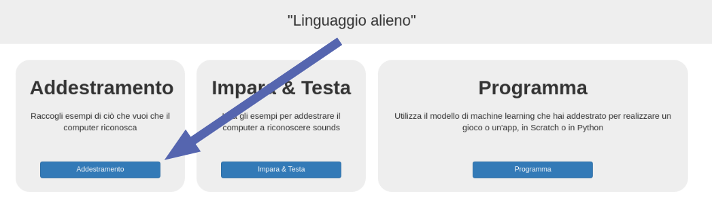
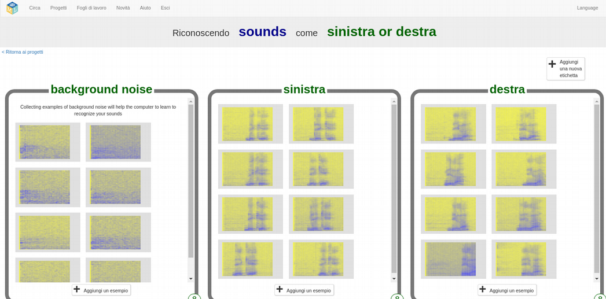

## Crea parole aliene
In questo passaggio, inventerai le tue parole aliene.

--- task ---

Hai bisogno di due parole: una parola aliena per "sinistra" e una parola aliena per "destra". Inventa due nuove parole che non sarebbero presenti in un dizionario italiano. Possono essere rumori casuali, purché tu possa ripeterli nello stesso modo ogni volta e siano riconoscibili l'uno dall'altro. Se non vuoi fare rumori con la tua voce, va bene - puoi trovare altri modi per fare rumori. Puoi schioccare le dita, battere le mani, stringere un giocattolo cigolante o fare qualsiasi altra cosa ti venga in mente! Assicurati solo di ricordare le tue nuove parole!

--- /task ---

--- task ---

+ Fai clic sul pulsante **Train** per iniziare a raccogliere esempi. 

+ Fai clic sul pulsante **Aggiungi un esempio** nel riquadro **background noise**. La registrazione del background noise (rumore di fondo) aiuterà il tuo modello di apprendimento automatico a distinguere tra i suoni che deve riconoscere e il rumore di fondo in cui ti trovi. 

+ Fai clic sul microfono per registrare 2 secondi di rumore di fondo. 

+ Fare clic sul pulsante **Aggiungi** per salvare la registrazione. 

+ Ripeti questi passaggi finché non hai **almeno 8 esempi** di rumore di fondo. 

--- /task ---

--- task ---

+ Fai clic sul pulsante **Aggiungi una nuova etichetta** nell'angolo in alto a destra e crea un nuovo riquadro di allenamento chiamato `sinistra`. 

+ Fai clic sul pulsante **Aggiungi esempio** nel nuovo riquadro **sinistra**. 

+ Registra **almeno 8 esempi** della tua parola aliena che significa "sinistra". 

--- /task ---

--- task ---

+ Fai di nuovo clic sul pulsante **Aggiungi una nuova etichetta** nell'angolo in alto a destra e crea un nuovo riquadro di addestramento chiamato `destra`.

+ Fai clic sul pulsante **Aggiungi un esempio** nel nuovo riquadro **destra**.

+ Registra **almeno 8 esempi** della tua parola aliena che significa "destra". 

+ **Nota:** Alla fine di questo passaggio, è necessario disporre di otto esempi in ciascuno dei tre riquadri.

--- /task ---
