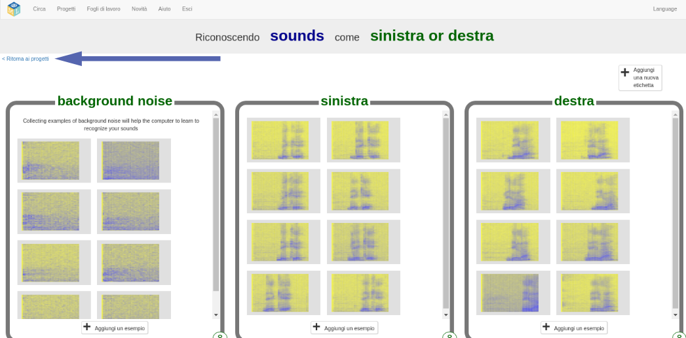
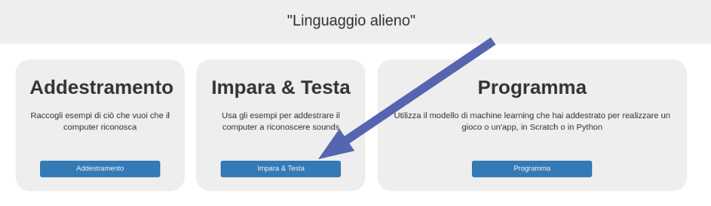
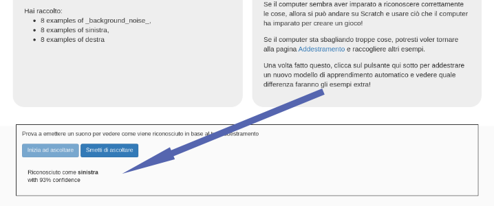

## Addestra un nuovo modello di apprendimento automatico
In questo passaggio, utilizzerai gli esempi raccolti nell'ultimo passaggio per addestrare il computer a riconoscere le tue nuove parole.

--- task ---

+ Fai clic sul link **Ritorna ai progetti** nell'angolo in alto a sinistra. 

+ Fai clic sul pulsante **Impara & Testa**. 

+ Fai clic su **Addestra nuovi modelli di machine learning**. Il completamento potrebbe richiedere alcuni minuti. 

--- /task ---

--- task ---

+ Al termine dell'allenamento, fai clic sul pulsante **Inizia ad ascoltare** per testare il tuo modello di apprendimento automatico. Pronuncia una delle parole (o crea uno dei suoni) che hai addestrato il computer a riconoscere come "sinistra" o "destra". Se il tuo modello di apprendimento automatico lo riconosce, mostrerà ciò che pensa tu abbia detto. 

+ Se non sei soddisfatto del funzionamento del modello, torna alla pagina **Addestramento** e aggiungi altri esempi a tutti e tre i riquadri di allenamento.

+ Quando sei soddisfatto del tuo modello di apprendimento automatico, vai al passaggio successivo.

--- /task ---
