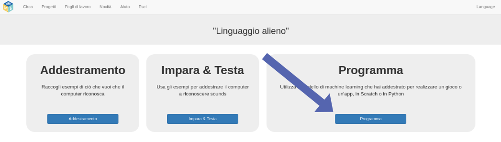
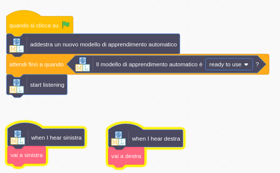

## Usa parole aliene in Scratch
In questo passaggio, utilizzerai il tuo nuovo modello di apprendimento automatico in Scratch.

--- task ---

+ Fai clic sul pulsante **Programma**. 

+ Fai clic sul pulsante **Scratch 3** , quindi fai clic su **Apri in Scratch 3**.

+ Fai clic su **Modelli di progetto** nella parte superiore dello schermo, quindi apri il modello di progetto **Alien Language**.

--- /task ---

--- task ---

+ Guarda gli script per lo sprite alieno. Gli script che sono già presenti metteranno lo sprite alieno nel posto giusto all'inizio e animeranno il modo in cui cammina. Non cancellarli. Aggiungi lo script qui sotto allo sprite alieno, sotto quelli che già ci sono. 

+ Ora prova il tuo programma! Fai clic sulla bandiera verde. Dì le tue parole (o fai i tuoi rumori) per "sinistra" e "destra" per dire all'alieno quale strada percorrere.

--- /task ---

Ora hai addestrato il tuo modello di apprendimento automatico per il riconoscimento vocale e lo hai usato per controllare un personaggio in Scratch. A differenza del modello predefinito che hai usato in precedenza nel progetto, che era stato addestrato per riconoscere decine di migliaia di parole, lo hai addestrato solo per riconoscere due parole distinte. Tuttavia, il principio è lo stesso.

Hai anche visto l'importanza di addestrare il modello di apprendimento automatico a lavorare con un certo rumore di fondo.

--- task ---

Riesci a pensare a un esempio di un sistema come quello che hai appena visto? Ad esempio, alcune auto utilizzano sistemi di riconoscimento vocale che sono stati addestrati per riconoscere i diversi comandi che è possibile impartire al computer dell'auto. Quali altri esempi hai usato?

--- /task ---
