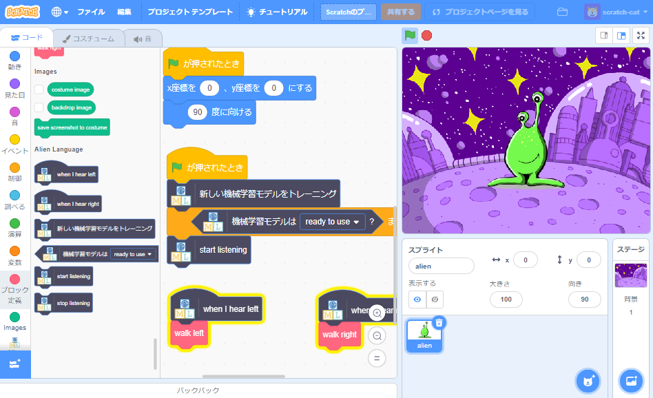

## はじめに

このプロジェクトでは、コンピューターがエイリアンの言葉を理解 (りかい) できるようにトレーニングします。 それにより、エイリアンがあなたの指示 (しじ) したことを理解しているかのようにエイリアンのキャラクターを動かすことができます。

### 作るもの

--- no-print ---

--- /no-print ---

--- print-only ---

--- /print-only ---

--- collapse ---
---
title: 必要（ひつよう）なもの
---

+ マイク付きのコンピューター

+ インターネットへの接続 (せつぞく)

--- /collapse ---

--- collapse ---
---
title: 学ぶこと
---
+ Scratch 3 で事前トレーニングずみモデルを使用して Speech to Text 拡張機能 (かくちょうきのう) を使用する方法
+ 機械学習 (きかいがくしゅう) モデルが音を認識 (にんしき) するようにトレーニングする方法
+ トレーニングした機械学習モデルをScratch 3で使用する方法

--- /collapse ---

--- collapse ---
---
title：教育者向けの追加情報
---

このプロジェクトを印刷する必要がある場合は、 [印刷用バージョン](https://projects.raspberrypi.org/en/projects/alien-language/print){:target="_ blank"}を使用してください。

--- /collapse ---

### ライセンス

このプロジェクトは、[クリエイティブ・コモンズ 表示 - 非営利 - 継承 ライセンス](http://creativecommons.org/licenses/by-nc-sa/4.0/) {:target="_ blank"}および[ Apache ライセンス・バージョン2.0 ](http://www.apache.org/licenses/LICENSE-2.0){:target="_ blank"} (英語) の両方の下でデュアルライセンスされています。

このプロジェクトに関するすべてに対して machinelearningforkids.co.uk の Dale 氏に感謝します。
