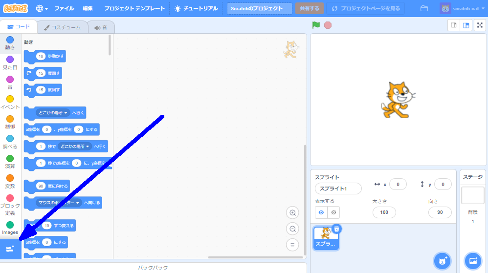
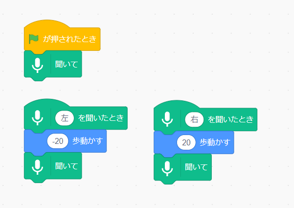
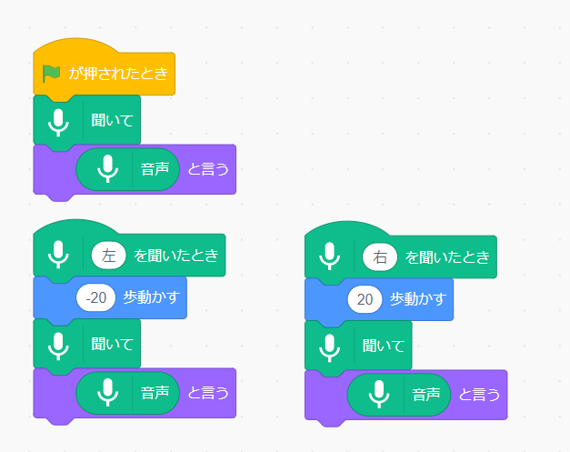

## 事前学習ずみのモデルを使用する

--- task ---
+ ウェブブラウザで [machinelearningforkids.co.uk/scratch3](https://machinelearningforkids.co.uk/scratch3/){:target="_ blank"} を開きます。 --- / task ---

**(注意)**プロジェクトのこのステップは、Google Chrome ウェブブラウザ上でしかできません。 Google Chrome ブラウザがない場合は、[ステップ3: 新しいプロジェクトを作成する](https://projects.raspberrypi.org/en/projects/alien-language/3)に進んでください。

--- task ---
+ 次に、 **Speech to Text** 拡張機能 (かくちょうきのう) を読みこみます。 左下すみの **拡張機能を追加** (ついか) ボタンをクリックし、リストから **Speech to Text** をえらびます。 **(注)** **音声合成** 拡張機能ではなく、 **Speech to Text** 拡張機能をえらびましょう。 

+ **イベント** ブロック、 **動き** ブロック、および新しい **音声認識** (にんしき) ブロックを使って、このスクリプトを作成します。　 

--- /task ---

--- task --- 緑の旗 (はた) をクリックしてプログラムをテストします。 マイクに向かって「左」または「右」と言いましょう。 Scratch のネコはあなたが言う方向に動くはずです。 声を使って Scratch のネコを左右に動かしてみてください。 おちついてはっきりと話すようにしましょう。

場合によってはうまく動かないことがあります。 そのときは、（音声）`と言う`ブロックを追加してみてください。スクリプトはこのようになり、声がスプライトにどう聞こえたかが表示 (ひょうじ) されます。  --- /task ---

これで、音声認識を使用して Scratch のキャラクターを操作 (そうさ) できました。

このステップでは、プログラムがすぐにうまく動くように、すでにトレーニングされた機械学習モデルを使用しました。 これは、辞書 (じしょ) にある単語 (たんご) を認識するようにトレーニングされた、一般的 (いっぱんてき) な機械学習モデルです。 
