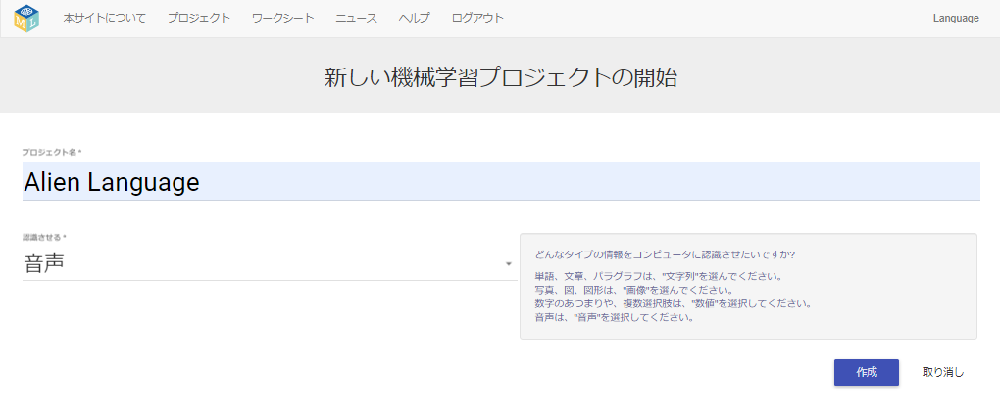

## 新しいプロジェクトを作成 (さくせい) する
ここからのステップでは、機械学習 (きかいがくしゅう) モデルをトレーニングして、どのように行うのかを見ていきます。 プロジェクトの次の部分では、声を使って、日本語が分からないエイリアンのキャラクターを操作 (そうさ) します。 辞書 (じしょ) にはない2つの新しい単語 (たんご) を考え出してください。 その単語を使ってエイリアンのキャラクターを操作します。また機械学習モデルがその単語を認識 (にんしき) するようにトレーニングします。

まず、Machine Learning for Kidsのウェブサイトにアクセスして、プロジェクトを作成します。

--- task ---
+ ウェブブラウザで [machinelearningforkids.co.uk](https://machinelearningforkids.co.uk/){:target="_ blank"} を開きます。

+ **開始**をクリックします。

+ **すぐに試す** (ためす) をクリックします。 --- /task ---

--- task ---
+ ページ上部のメニューバーで**プロジェクト**をクリックします。

+ **新しいプロジェクトの追加** (ついか) ボタンをクリックします。

+ プロジェクト名に `Alien Language` (エイリアン語) と入力して、 `音声`を認識させるように設定 (せってい) します。(プロジェクト名に日本語は使えません) 次に、 **作成** ボタンをクリックします。 

+ プロジェクトのリストに `Alien Language` が表示 (ひょうじ) されます。 `Alien Language` プロジェクトをクリックします。 --- /task ---
