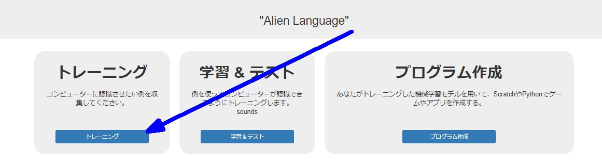
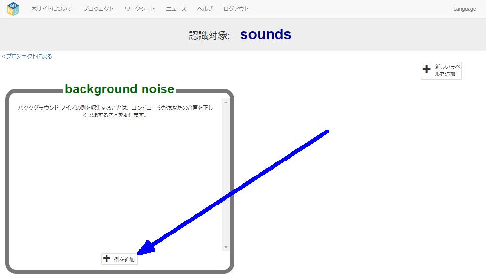
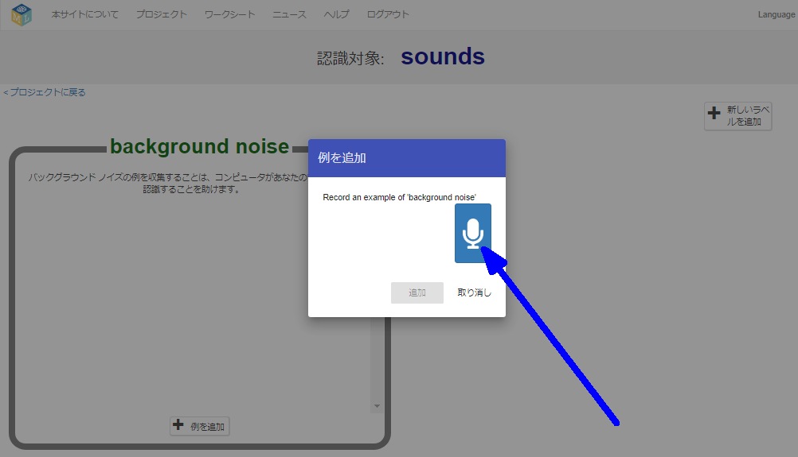
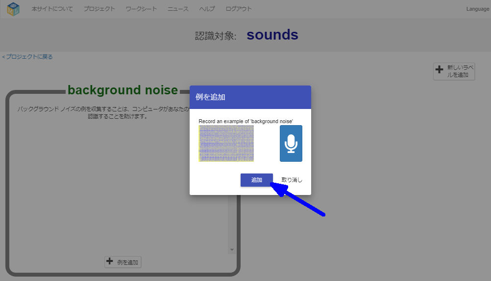
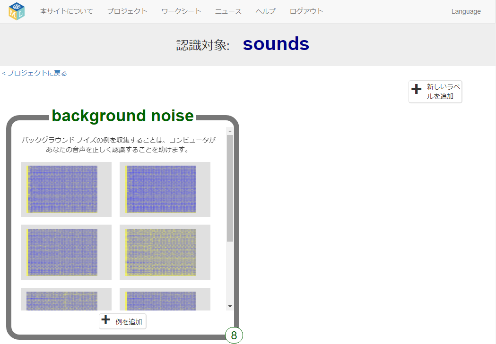
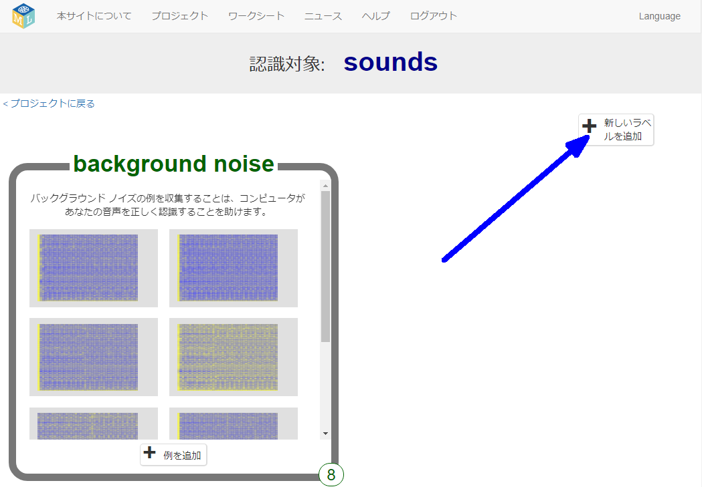
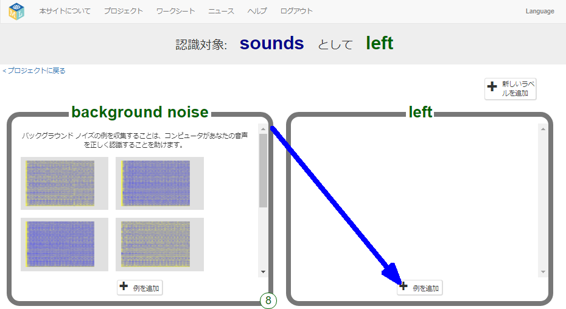
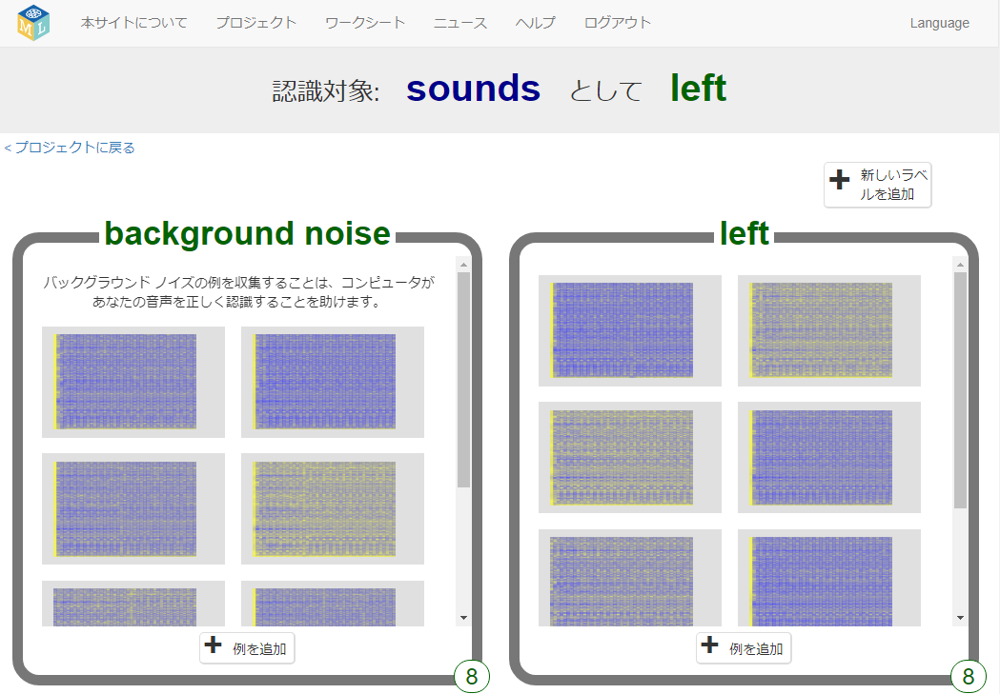
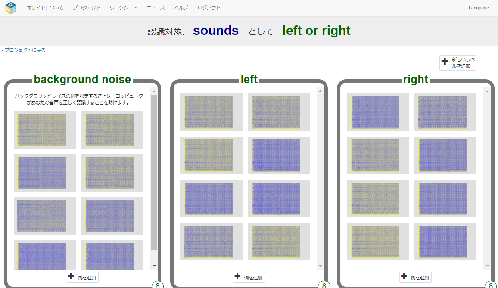

## エイリアン語を作る
このステップでは、エイリアン語を考え出します。

--- task ---

「左」を表すエイリアン語と「右」を表すエイリアン語の2つが必要です。 辞書にはない2つの新しい単語を考え出しましょう。 毎回同じようにくり返すことができて、2つの音がはっきりとちがう音だと認識されるのであれば、でたらめな音でもかまいません。 声を使いたくなくても、だいじょうぶです。ほかにも音を立てる方法があります。 指を鳴らしたり、手をたたいたり、音の出るおもちゃをにぎるなど、何でもかまいません！ ただし、新しい単語 (または音) が何であるかをわすれないように気をつけましょう！

--- /task ---

--- task ---

+ **トレーニング** ボタンをクリックして、サンプルの収集 (しゅうしゅう) を開始します。 

+ **background noise** (バックグラウンドノイズ - まわりのざつ音) バケットにある**例 (れい) を追加**ボタンをクリックします。 バックグラウンドノイズを録音 (ろくおん) すると、機械学習モデルが認識するようにトレーニングする音と、今いる場所のバックグラウンドノイズのちがいを区別 (くべつ) するのに役立ちます。 

+ マイクをクリックして、2秒間のバックグラウンドノイズを録音します。 

+ **追加** ボタンをクリックして、録音を保存します。 

+ バックグラウンドノイズの**少なくとも8つのサンプル** ができるまで、この手順 (てじゅん) をくり返します。 

--- /task ---

--- task ---

+ 右上すみにある**新しいラベルを追加**ボタンをクリックし、 `left` (左) という新しいトレーニングバケットを作成します。 

+ 新しい **left**バケットの **例を追加** ボタンをクリックします。 

+ 「左」を表すエイリアン語の **少なくとも8つのサンプル**を録音します。 

--- /task ---

--- task ---

+ 右上すみにある**新しいラベルを追加**ボタンをもう一度クリックし、 `right` (右) という新しいトレーニングバケットを作成します。

+ 新しい **right** バケットの **例を追加** ボタンをクリックします。

+ 「右」を表すエイリアン語の **少なくとも8つのサンプル**を録音します。 

+ **(注)** このステップを終わる前に、3つのバケットのそれぞれに8つのサンプルが必要です。

--- /task ---
