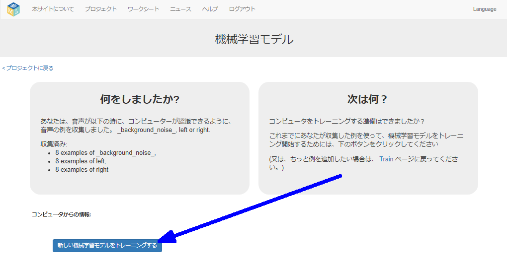

## 新しい機械学習モデルをトレーニングする
このステップでは、前のステップで収集したサンプルを使用して、コンピューターが新しい単語を認識するようにトレーニングします。

--- task ---

+ 左上すみにある**プロジェクトに戻る** (もどる) リンクをクリックします。 

+ **学習 & テスト** ボタンをクリックします。 

+ **新しい機械学習モデルをトレーニングする**クリックします。 これには数分かかる場合があります。 

--- /task ---

--- task ---

+ トレーニングが終わったら、 **聞いてみよう** ボタンをクリックして、機械学習モデルをテストします。 「左」または「右」として認識するようにコンピューターをトレーニングした言葉の1つを発声します（または音を立てます）。 機械学習モデルがそれを認識すると、あなたが言ったと思うことを表示します。 

+ モデルの動作に満足 (まんぞく) できない場合は、 **トレーニング** ページにもどって、3つのトレーニングバケットすべてにさらにサンプルを追加してください。

+ 機械学習モデルに満足したら、次のステップに進みます。

--- /task ---
