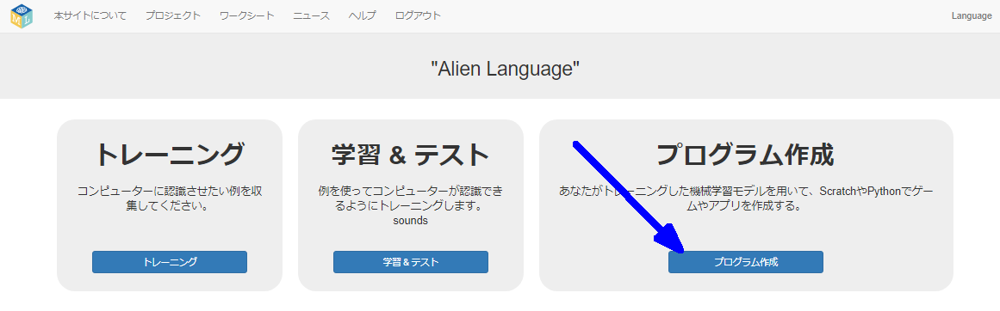
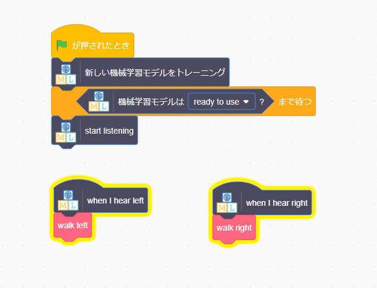

## Scratch でエイリアン語を使う
このステップでは、新しい機械学習をScratchで使用します。

--- task ---

+ **プログラム作成** ボタンをクリックします。 

+ **Scratch 3** ボタンをクリックしてから、 **Scratch 3で開く**をクリックします。

+ 上部の **プロジェクトテンプレート** をクリックし、 **Alien Language** プロジェクトテンプレートを開きます。

--- /task ---

--- task ---

+ エイリアンのスプライトのスクリプトを見てください。 はじめから入っているスクリプトは、開始時にエイリアンのスプライトを真ん中に配置 (はいち) し、エイリアンの動き方を決めるものです。 このスクリプトを削除 (さくじょ) しないでください。 エイリアンのスプライトのすでにあるスクリプトの下に、このスクリプトを追加します。 

+ さあ、プログラムをテストしましょう！ 緑の旗 (はた) をクリックします。 「左」と「右」を表す単語を言って（または音を立てて）エイリアンにどちらの方向に歩くかをつたえます。

--- /task ---

これで、音声認識を行うための機械学習モデルをトレーニングし、それを使って Scratch のキャラクターを操作できました。 プロジェクトのステップ2で使った、数万の単語を認識するようにトレーニングされた事前トレーニングモデルとはことなり、ここでは2つのちがう単語を認識するようにトレーニングしただけです。 しかし、原理は同じです。

また、あるバックグラウンドノイズがあっても動作するように機械学習モデルをトレーニングすることの大切さも分かりました。

--- task ---

今までに見たことのあるシステムので、このようなものは思いつきますか？ たとえば、自動車の中には、車載 (しゃさい) コンピューターにつたえることができるさまざまなコマンドを認識するようにトレーニングされた、音声認識システムを使用しているものがあります。 他にどのようなものを使ったことがありますか？

--- /task ---
