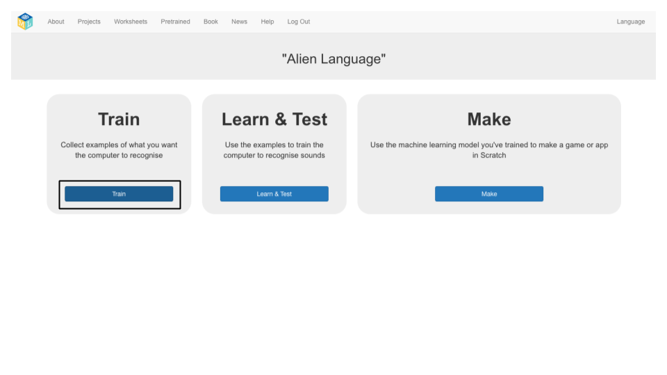
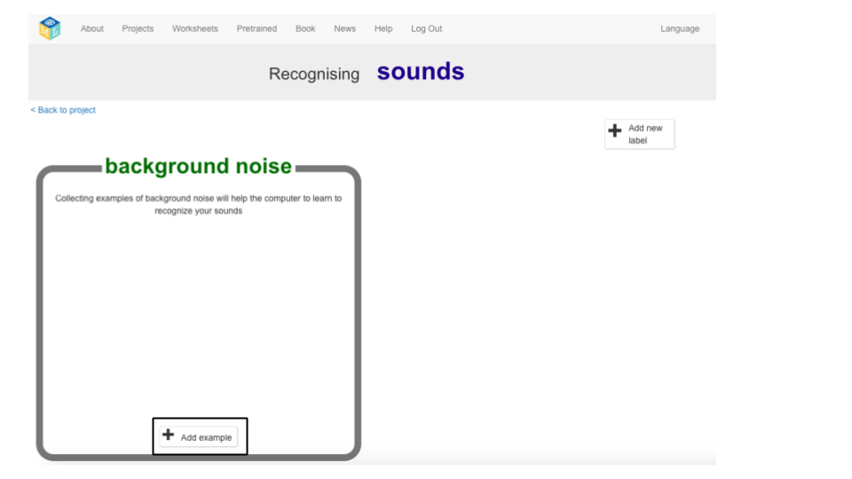
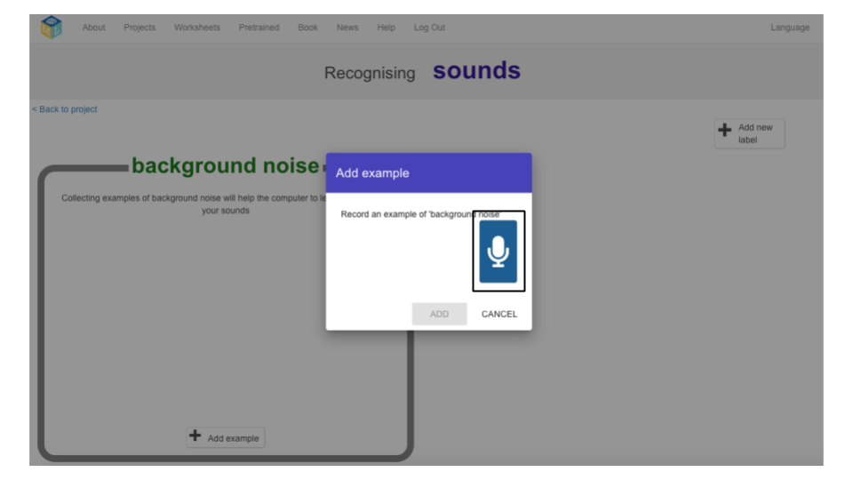
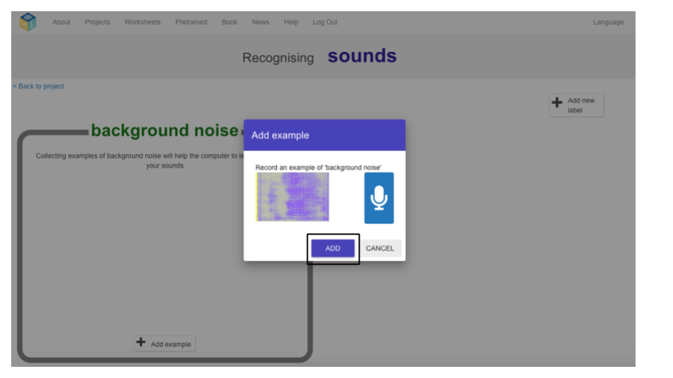
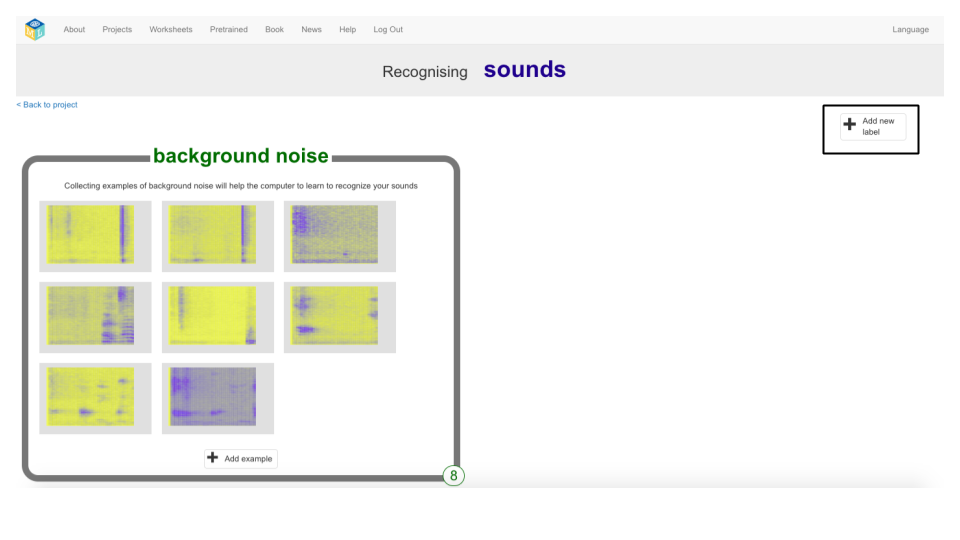
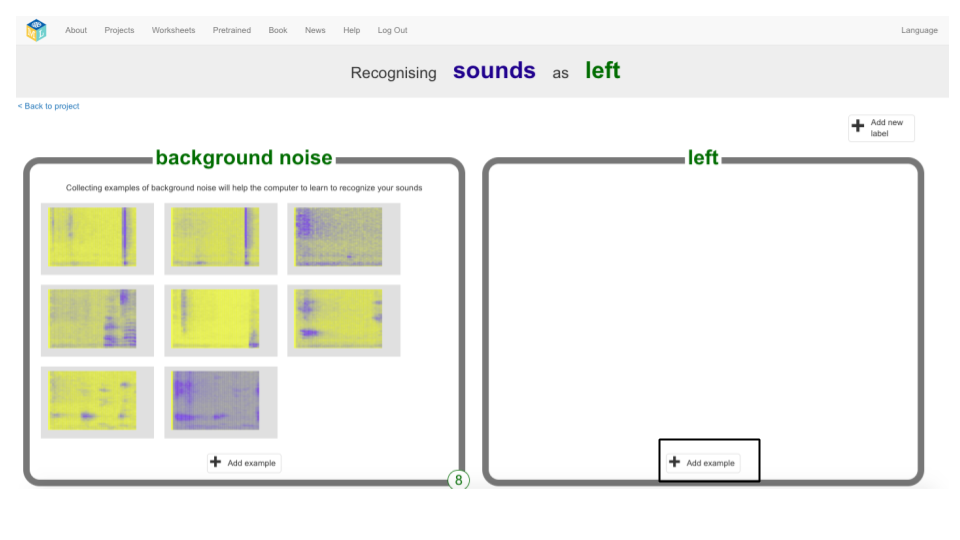
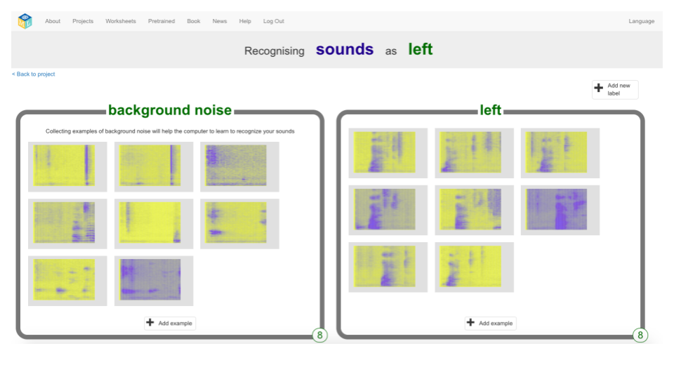
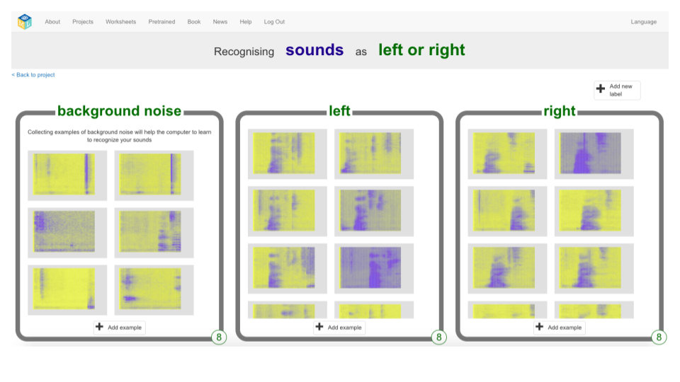

## 외계인 단어 만들기
이 단계에서는 외계인 단어를 발명합니다.

--- task ---

"왼쪽"의 외계인 단어와 "오른쪽"의 외계인 단어가 필요합니다. 영어 사전에없는 두 개의 새로운 단어를 발명하십시오. 매번 같은 방식으로 반복 할 수 있고 서로 구별 할 차이가 있는 한, 임의의 소음일 수 있습니다. 목소리로 소음을 내고 싶지 않다면 괜찮습니다. 다른 소리를내는 방법을 찾을 수 있습니다. 손가락을 클릭하거나 손 cla을 치거나 삐걱 거리는 장난감을 쥐거나 다른 생각을 할 수 있습니다! 새로운 단어를 기억하십시오!

--- /task ---

--- task ---

+ **Train** 버튼을 클릭하여 예제 수집을 시작합니다. 

+ **백그라운드 노이즈** 버킷에서 **예제** 추가 버튼을 클릭하십시오. 배경 소음을 녹음하면 기계 학습 모델이 인식하도록 훈련시킬 소리와 배경 소음 간의 차이를 알 수 있습니다. 

+ 마이크를 클릭하여 2 초의 배경 소음을 녹음합니다. 

+ **추가** 버튼을 클릭하여 기록을 저장하십시오. 

+ **적어도 8개의 예제** 배경 잡음이 될 때까지 이러한 단계를 반복합니다. 

--- /task ---

--- task ---

+ 오른쪽 상단 모서리에있는 **새 레이블 추가** 버튼을 클릭하고 `left`라는 새로운 훈련 바구니를 만듭니다. 

+ 새로운 **left** 바구니에서 **예제 추가** 버튼을 클릭하십시오. 

+ **적어도 8개 예제**의 “left”관련 외계인 단어를 기록하십시오. 

--- /task ---

--- task ---

+ 오른쪽 상단 모서리에있는 **새 레이블 추가** 버튼을 다시 클릭하고 `right`이라는 새 훈련 바구니를 만듭니다.

+ 새로운 **right** 바구니에서 **예제 추가** 버튼을 클릭하십시오.

+ “right”에 관련 외계어의 **적어도 8개의 예제**를 기록하십시오. 

+ **참고:** 이 단계를 마치면, 3 개의 바구니 각각에 8 개의 예제가 있어야합니다.

--- /task ---
