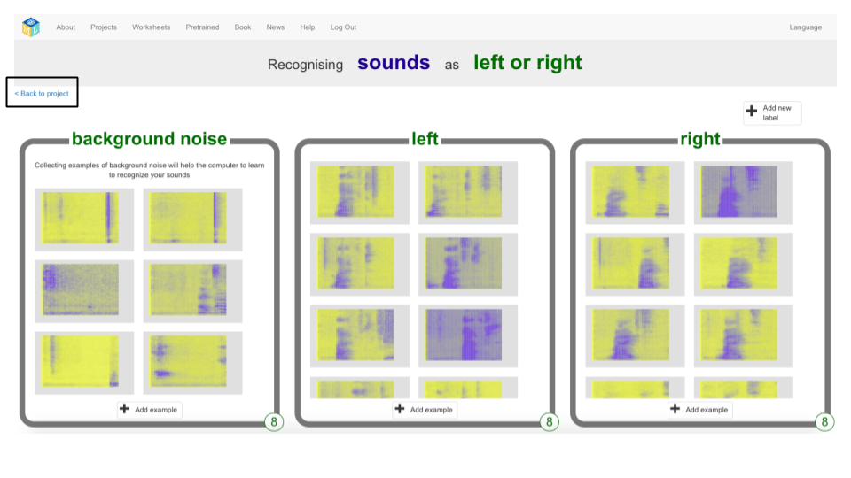
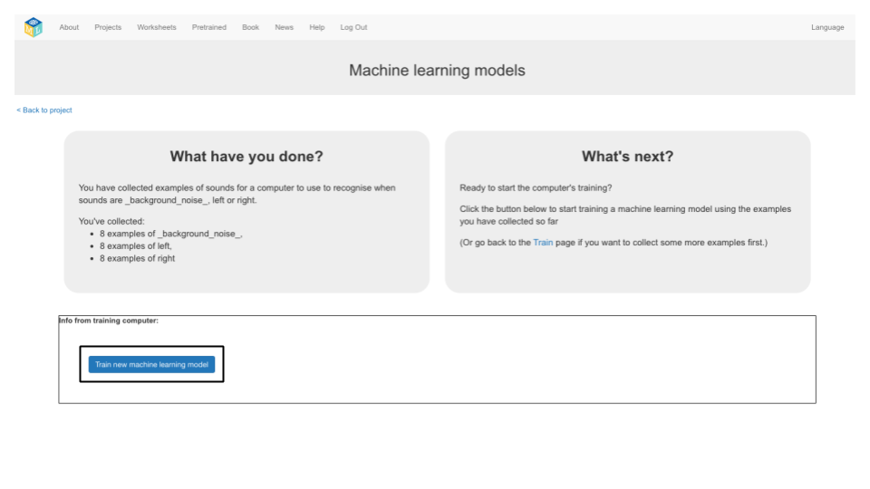
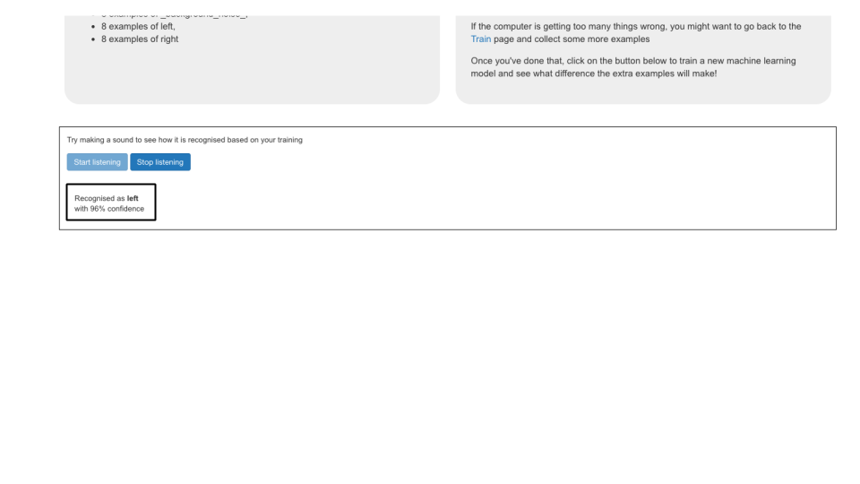

## 새로운 머신 러닝 모델 훈련
이 단계에서는 마지막 단계에서 수집 한 예제를 사용하여 컴퓨터에서 새 단어를 인식하는 방법을 학습시킵니다.

--- task ---

+ 왼쪽 상단에 있는 **프로젝트로 되돌아가기** 링크를 클릭하십시오. 

+ **학습하기 & 테스트하기** 버튼을 클릭하십시오. 

+ **새 기계 학습 모델 훈련**을 클릭하십시오. 완료하는 데 몇 분이 걸릴 수 있습니다. 

--- /task ---

--- task ---

+ 교육이 완료되면 **청취 시작** 버튼을 클릭하여 기계 학습 모델을 테스트하십시오. 컴퓨터가 "왼쪽"또는 "오른쪽"으로 인식하도록 훈련시킨 단어 중 하나 (또는 소리 중 하나)를 말합니다. 머신 러닝 모델이 이를 인식하면, 사용자가 말했다고 생각한 것을 표시합니다. 

+ 모델의 작동 방식이 마음에 들지 않으면, **훈련하기** 페이지로 돌아가서 모든 세 개의 훈련 바구니에 더 많은 예제를 추가하십시오.

+ 머신 러닝 모델에 만족하면 다음 단계로 넘어갑니다.

--- /task ---
