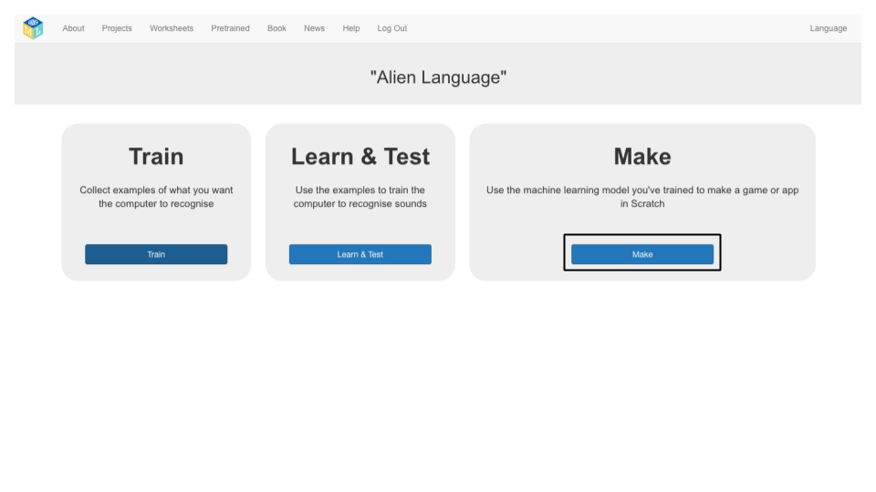

## 스크래치에서 외계인 단어 사용
이 단계에서는 스크래치에서 새로운 머신 러닝을 사용합니다.

--- task ---

+ **만들기** 버튼을 클릭하십시오. 

+ **Scratch 3** 버튼을 클릭 한 다음 **Scratch 3으로 열기**를 클릭하십시오.

+ 화면 상단의 **프로젝트 템플릿** 을 클릭 한 다음 **Alien Language** 프로젝트 템플릿을 엽니다.

--- /task ---

--- task ---

+ 외계어 스프라이트의 스크립트를보십시오. 그곳에 이미 존재하는 스크립트는 시작시 오른쪽 위치에 외계어 스프라이트를 배치하고 어떻게 움직이는 지 동작시킵니다. 삭제하지 마십시오. 이미 존재하는 스크립트 아래의 외계어 스프라이트에 아래 스크립트를 추가하십시오. 

+ 이제 프로그램을 테스트하십시오! 녹색 깃발을 클릭하십시오. “왼쪽”과 “오른쪽”에 대해 말을하거나 소리를내어 외계인에게 어느 방향으로 걷게 할 지 말하십시오.

--- /task ---

이제 음성 인식을 수행하도록 자체 머신 러닝 모델을 학습했으며 스크래치에서 캐릭터를 제어하는 데 사용했습니다. 수만 개의 단어를 인식하도록 훈련 된 프로젝트에서 이전에 사용한 사전 훈련 된 모델과 달리, 두 개의 다른 단어를 인식하도록 훈련했습니다. 하지만, 원리는 같습니다.

또한 특정 배경 소음에서 작동하도록 기계 학습 모델을 훈련하는 것이 중요하다는 것을 알았습니다.

--- task ---

이전에 본 것과 같은 시스템의 예를 생각할 수 있습니까? 예를 들어, 일부 차량은 차량 내 컴퓨터에 부여 할 수 있는 다양한 명령을 인식하도록 훈련 된 음성 인식 시스템을 사용합니다. 다른 예는 무엇입니까?

--- /task ---
