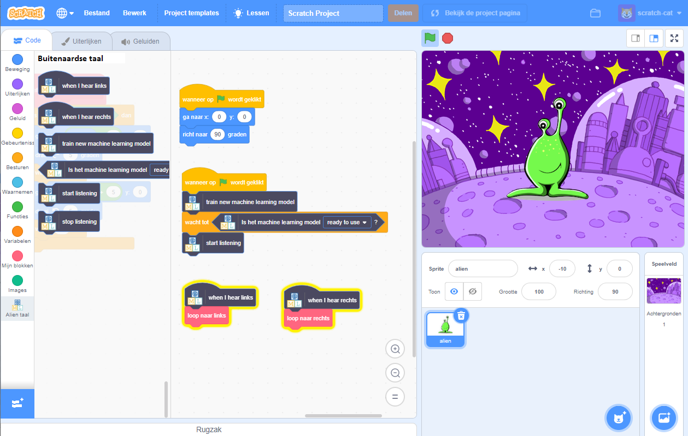

## Inleiding

In dit project zul je de computer trainen om een buitenaardse taal te begrijpen. Je zult dat gebruiken om een buitenaards karakter te besturen, zodat het kan begrijpen wat je zegt dat het moet doen.

### Wat ga je maken

--- no-print ---

--- /no-print ---

--- print-only ---

--- /print-only ---

--- collapse ---
---
title: Wat heb je nodig
---

+ Een computer met een microfoon

+ Internettoegang

--- /collapse ---

--- collapse ---
---
title: Wat ga je leren
---
+ De extensie spraak naar tekst in Scratch 3 gebruiken met een vooraf getraind model
+ Hoe een machine learning model te trainen om geluiden te herkennen
+ Gebruik van jouw getraind machine learning-model in Scratch 3

--- /collapse ---

--- collapse ---
---
title: Aanvullende informatie voor docenten
---

Als je dit project wilt afdrukken, gebruik dan de [printervriendelijke versie](https://projects.raspberrypi.org/nl-NL/projects/alien-language/print){:target="_ blank"}.

--- /collapse ---

### Licentie

Dit project heeft een dubbele licentie onder zowel een [Creative Commons Attribution Non-Commercial Share-Alike-licentie](http://creativecommons.org/licenses/by-nc-sa/4.0/){:target="_blank"} en een [Apache-licentie versie 2.0](http://www.apache.org/licenses/LICENSE-2.0){:target="_blank"}

We willen Dale van machinelearningforkids.co.uk graag bedanken voor al zijn werk aan dit project.
