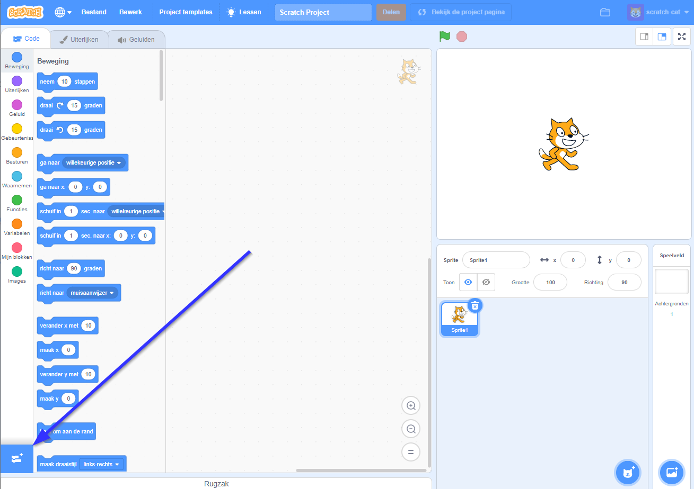
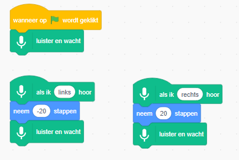
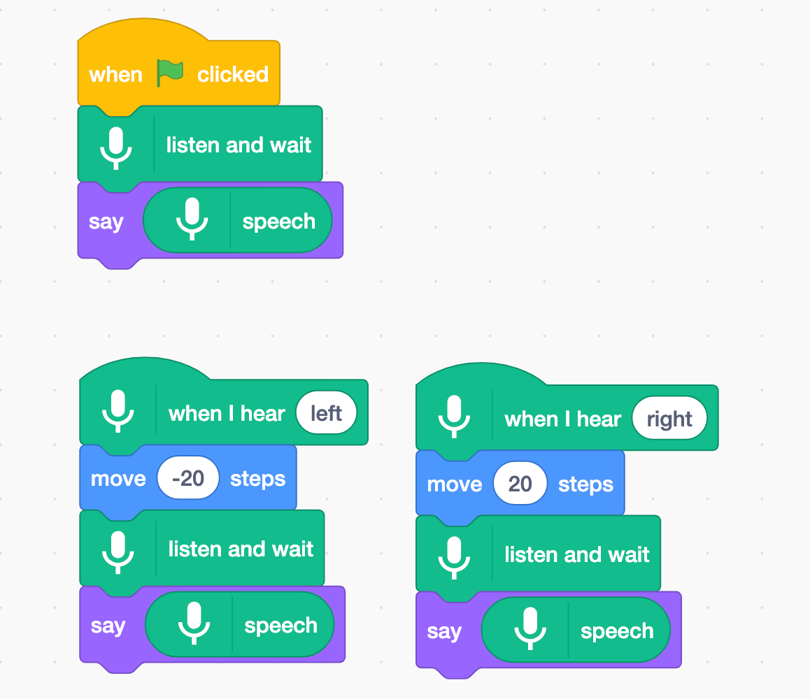

## Gebruik een vooraf getraind model

--- task ---
+ Ga naar [machinelearningforkids.co.uk/scratch3](https://machinelearningforkids.co.uk/scratch3/){:target="_ blank"}
--- / task ---

**Waarschuwing:** Deze stap van het project kan alleen worden voltooid met de webbrowser Google Chrome. Als deze browser voor jou niet beschikbaar is, ga dan naar [stap 3: Maak een nieuw project](https://projects.raspberrypi.org/en/projects/alien-language/3)

--- task ---
+ Laad vervolgens de extensie **Spraak naar tekst**. Klik op de knop **Uitbreiding** in de linkerbenedenhoek en kies vervolgens **Spraak naar tekst** in de lijst. **Opmerking:** Zorg ervoor dat je de extensie **Spraak naar tekst** selecteert, en niet de extensie **Tekst naar spraak**. 

+ Gebruik **Gebeurtenissen** blokken, **Beweging** blokken en de nieuwe **Spraak naar tekst** blokken om de volgende scripts te maken. 

--- /task ---

--- task --- Klik op de groene vlag om je programma te testen. Zeg "links" of "rechts". De Scratch-kat zou in de richting moeten gaan die jij zegt. Gebruik je stem om de Scratch-kat over het scherm heen en weer te bewegen. Probeer kalm en duidelijk te spreken.

Het kan moeilijk zijn om het te laten werken. Als het niet werkt, voeg dan `zeg` blokken toe zodat je script eruitziet als het onderstaande script, om te laten zien wat het denkt dat je zegt.  --- /task ---

Je hebt nu spraakherkenning gebruikt om een karakter in Scratch te besturen.

In deze stap gebruikte je een machine learning-model dat al voor jouw was getraind om je programma snel te laten werken. Het is een algemeen model voor machine learning dat is getraind om woorden in het Engelse woordenboek te herkennen. 
