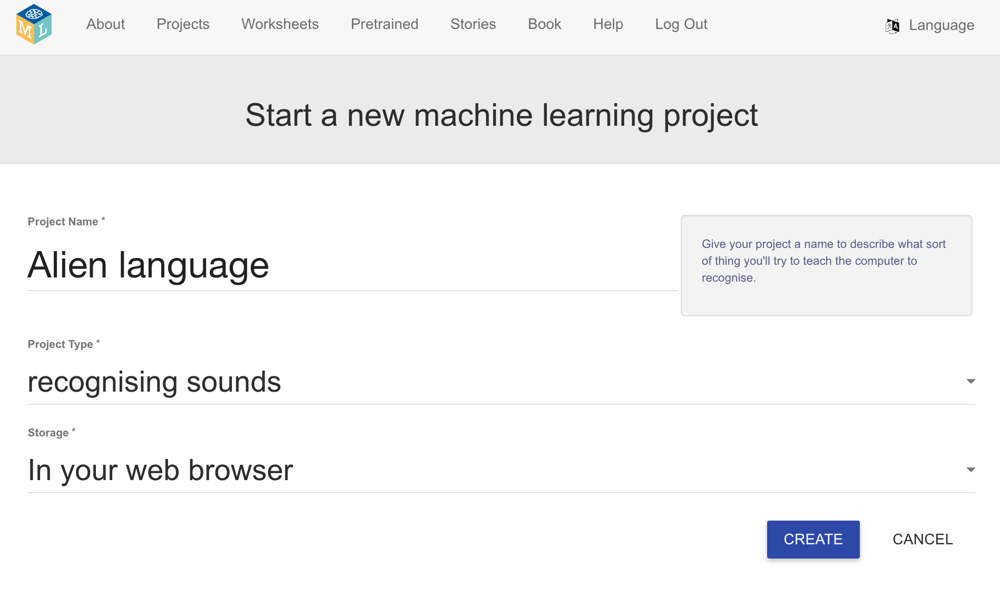
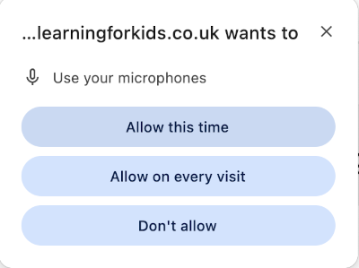

## Het project opzetten

<html>
  

    <iframe style="position: absolute; top: 0; left: 0; right: 0; width: 100%; height: 100%; border: none;" src="https://www.youtube.com/embed/F4HePu4SNrs?rel=0&cc_load_policy=1" allowfullscreen allow="accelerometer; autoplay; clipboard-write; encrypted-media; gyroscope; picture-in-picture; web-share"></iframe>
  

</html>

--- task ---

+ Ga naar [machinelearningforkids.co.uk](https://machinelearningforkids.co.uk/){:target="_blank"} in een webbrowser.

+ Klik op **Begin**.

+ Klik op **Probeer nu**.

--- /task ---

--- task ---

+ Klik op **Projecten** in de menubalk bovenaan.

+ Klik op de knop **+ Voeg een nieuw project toe**.

+ Geef je project de naam `Buitenaardse taal` en stel het in om **geluiden** te leren herkennen en sla gegevens op **in je webbrowser**. Klik vervolgens op **Creëer**.

+ Je zou nu 'Buitenaardse taal' in de projectenlijst moeten zien. Klik op dit project.

--- /task ---

--- task ---

+ Klik op de knop **Train**.

+ Als je een pop-upbericht ziet met de vraag om de microfoon te gebruiken, klik dan op **Toestaan bij elk bezoek**.

--- /task ---

