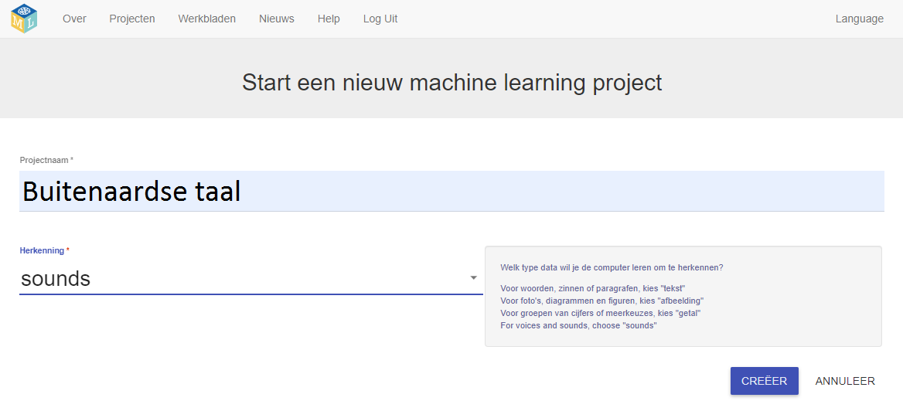

## Maak een nieuw project
In de volgende paar stappen train je een machine learning-model om te zien hoe dat wordt gedaan. Voor het volgende deel van het project gebruik je je stem om een buitenaards personage te besturen dat geen Engels begrijpt! Je zult twee nieuwe woorden uitvinden die je niet in een woordenboek zult vinden. Vervolgens zul je de woorden gebruiken om het buitenaardse karakter te besturen en een machine learning-model trainen om ze te herkennen.

Ga eerst naar de website Machine Learning for Kids en maak een project.

--- task ---
+ Ga naar [machinelearningforkids.co.uk](https://machinelearningforkids.co.uk/){:target="_blank"}.

+ Klik op **Begin**.

+ Klik op **Probeer nu**. --- /task ---

--- task ---
+ Klik op **Projecten** in de menubalk bovenaan de pagina.

+ Klik op de knop **Voeg een nieuw project toe**.

+ Geef je project als naam `Buitenaardse taal` en stel het in om te leren hoe het `geluiden (sounds)` herkent. Klik vervolgens op de knop **Creëer**. 

+ Je zou `Buitenaardse taal` in de projectenlijst moeten zien. Klik op het project `Buitenaardse taal`. --- /task ---
