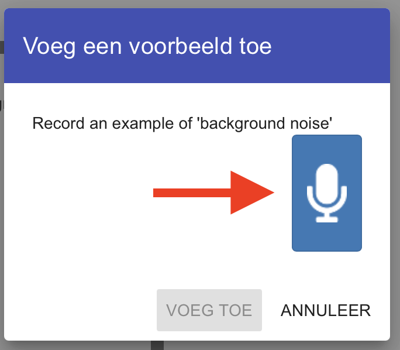
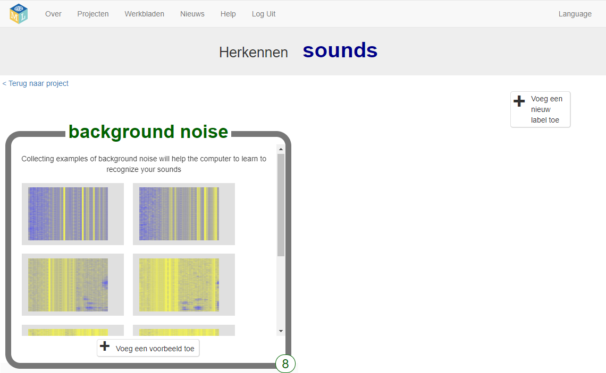

## Verzin twee woorden

<html>
  

    <iframe style="position: absolute; top: 0; left: 0; right: 0; width: 100%; height: 100%; border: none;" src="https://www.youtube.com/embed/au4cDSYW_EQ?rel=0&cc_load_policy=1" allowfullscreen allow="accelerometer; autoplay; clipboard-write; encrypted-media; gyroscope; picture-in-picture; web-share"></iframe>
  

</html>

Eerst verzamel je voorbeelden van achtergrondgeluiden. Dit helpt je machine learning-model om het verschil te horen tussen de geluiden die je zult gebruiken om te herkennen en het achtergrondgeluid van waar je bent.

--- task ---

+ Klik op de **+ Voeg een voorbeeld toe** knop in **background noise**.

+ Klik op de microfoon, maar zeg niets. Neem 2 seconden achtergrondgeluid op.

+ Klik op de knop **VOEG TOE** om jouw opname op te slaan.

--- /task ---

--- task ---

+ Herhaal deze stappen totdat je **minimaal acht voorbeelden** van achtergrondgeluiden hebt.

--- /task ---

Bedenk twee buitenaardse woorden: een woord dat "links" betekent en een woord dat "rechts" betekent.

Nu ga je acht voorbeelden van elk woord vastleggen, zodat jouw machine learning-model deze kan leren herkennen.

--- task ---

+ Klik rechtsboven in het scherm op **+ Voeg een nieuw label toe** en voeg een label toe met de naam `links`.

--- /task ---

--- task ---

+ Klik op **+ Voeg een voorbeeld toe** in het vak voor het nieuwe `links` label en neem jezelf op terwijl je jouw buitenaards woord voor "links" zegt.

+ Herhaal dit totdat je **minstens acht voorbeelden** hebt opgenomen.

--- /task ---

--- task ---

+ Klik op **+ Voeg een nieuw label toe** om een ander label te maken met de naam `rechts` en neem acht voorbeelden van jouw buitenaardse woord voor "rechts" op.

--- /task ---
