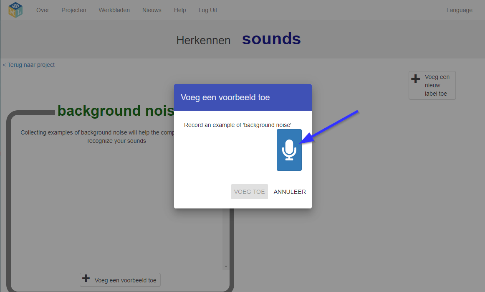

## Maak buitenaardse woorden
In deze stap verzin je je buitenaardse woorden.

--- task ---

Je hebt twee woorden nodig - een buitenaards woord voor "links" en een buitenaards woord voor "rechts". Verzin twee nieuwe woorden die niet in een woordenboek voorkomen. Het kunnen willekeurige geluiden zijn, zolang je ze elke keer op dezelfde manier kunt herhalen en ze duidelijk van elkaar verschillen. Als je geen geluiden wilt maken met je stem, is dat prima - je kunt andere manieren vinden om geluiden te maken. Je kunt op je vingers klikken, in je handen klappen, in een piepend stuk speelgoed knijpen of iets anders doen wat je maar kunt bedenken! Zorg ervoor dat je je nieuwe woorden onthoudt!

--- /task ---

--- task ---

+ Klik op de knop **Train** om voorbeelden te verzamelen. 

+ Klik op de knop **Voeg een voorbeeld toe** in de container **background noise (achtergrondruis)**. Door achtergrondgeluid op te nemen, kan je machine learning-model het verschil horen tussen de geluiden die je zult gebruiken om te herkennen en het achtergrondgeluid van waar je bent. 

+ Klik op de microfoon om 2 seconden achtergrondgeluid op te nemen. 

+ Klik op de knop **Voeg toe** om je opname op te slaan. 

+ Herhaal deze stappen totdat je **minimaal 8 voorbeelden** van achtergrondruis hebt. 

--- /task ---

--- task ---

+ Klik op de **Voeg een nieuw label toe** knop in de rechterbovenhoek, en maak een nieuwe training container die je `links` noemt. 

+ Klik op de knop **Voeg een voorbeeld toe** in de nieuwe container **links**. 

+ Neem **ten minste 8 voorbeelden** van je buitenaardse woord op voor 'links'. 

--- /task ---

--- task ---

+ Klik opnieuw op de knop **Voeg een nieuw label toe** in de rechterbovenhoek en maak een nieuwe container aan met de naam `rechts`.

+ Klik op de knop **Voeg een voorbeeld toe** in de nieuwe container **rechts**.

+ Neem **minimaal 8 voorbeelden** van je buitenaardse woord op voor 'rechts'. 

+ **Opmerking:** Aan het einde van deze stap moet je acht voorbeelden in elk van de drie containers hebben.

--- /task ---
