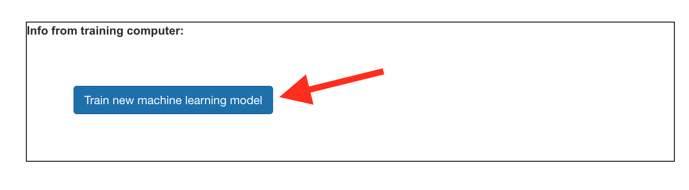

## Maak buitenaardse woorden

<html>
  

    <iframe style="position: absolute; top: 0; left: 0; right: 0; width: 100%; height: 100%; border: none;" src="https://www.youtube.com/embed/o4J5c0o5lVE?rel=0&cc_load_policy=1" allowfullscreen allow="accelerometer; autoplay; clipboard-write; encrypted-media; gyroscope; picture-in-picture; web-share"></iframe>
  

</html>

Je hebt de voorbeelden verzameld die je nodig hebt, nu ga je deze gebruiken om jouw machine learning model te trainen.

--- task ---

+ Klik op **Terug naar project** in de linkerbovenhoek.

+ Klik op **Leer & Test**.

+ Klik op de knop met het label **Train nieuw machine learning model**. Dit kan enkele minuten duren. 

--- /task ---

Zodra het trainen is voltooid, kun je testen hoe goed jouw model jouw zelfbedachte buitenaardse woorden herkent.

--- task ---

+ Neem **minimaal 8 voorbeelden** van je buitenaardse woord op voor 'rechts'.

Als je machine learning model dit herkent, wordt weergegeven wat het model voorspelt dat jij hebt gezegd. 

+ Test of het model ook jouw buitenaardse woord voor "rechts" herkent.

--- /task ---

Als je niet tevreden bent met hoe het model werkt, ga dan terug naar de **Train** pagina en voeg meer voorbeelden toe, en train daarna je model opnieuw.

