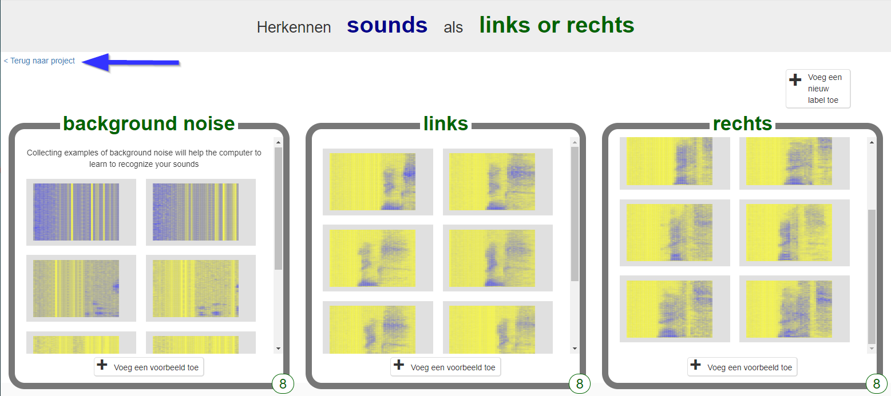
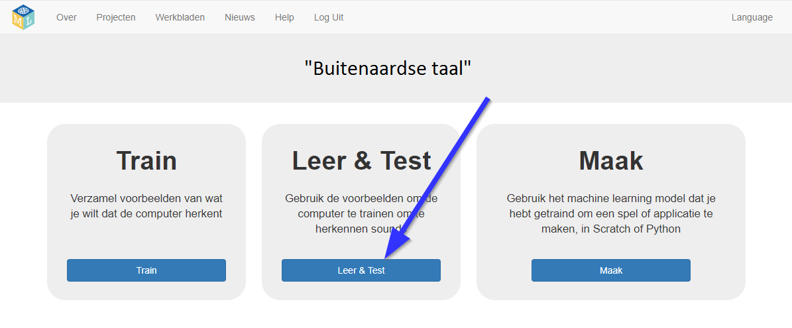
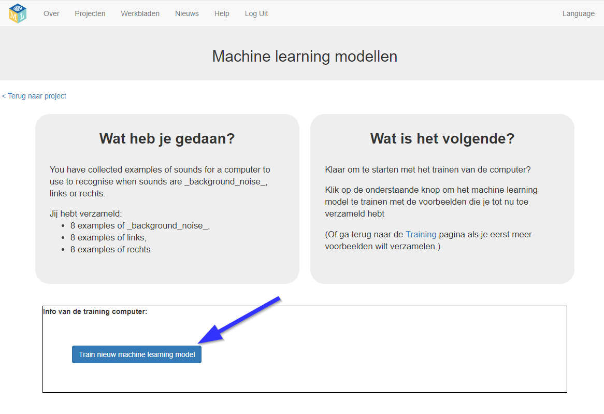
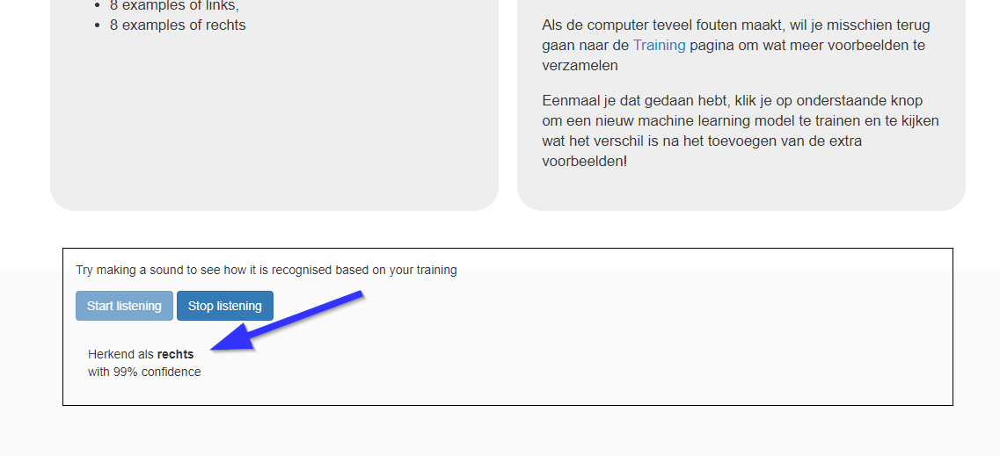

## Train een nieuw model voor machine learning
In deze stap gebruik je de voorbeelden die je in de laatste stap hebt verzameld om de computer te trainen in het herkennen van jouw nieuwe woorden.

--- task ---

+ Klik op de link **Terug naar project** in de linkerbovenhoek. 

+ Klik op de knop **Leer & Test**. 

+ Klik op **Train nieuw machine learning model**. Dit kan enkele minuten duren. 

--- /task ---

--- task ---

+ Nadat de training is voltooid, klik je op de knop **Start listening** om je machine learning-model te testen. Zeg een van de woorden (of maak een van de geluiden) die je de computer hebt getraind om te herkennen als "links" of "rechts". Als je machine learning-model dit herkent, wordt weergegeven wat het denkt te hebben gezegd. 

+ Als je niet tevreden bent met hoe het model werkt, ga je terug naar de pagina **Train** en voeg je meer voorbeelden toe aan alle drie de trainings containers.

+ Als je tevreden bent met jouw machine learning-model, ga je verder met de volgende stap.

--- /task ---
