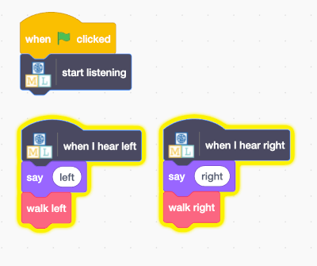

## Bestuur het buitenaardse wezen

<html>
  

    <iframe style="position: absolute; top: 0; left: 0; right: 0; width: 100%; height: 100%; border: none;" src="" allowfullscreen allow="accelerometer; autoplay; clipboard-write; encrypted-media; gyroscope; picture-in-picture; web-share"></iframe>
  

</html>

Nu je model verschillende woorden kan onderscheiden, kun je het gebruiken in een Scratch-programma om een buitenaards wezen te besturen.

--- task ---

+ Klik op de link **Terug naar project** in de linkerbovenhoek.

+ Klik op **Maak**.

+ Klik op **Scratch 3**.

+ Klik op **Open in Scratch 3**.

--- /task ---

--- task ---

+ Klik bovenaan op **Project templates** en selecteer het project 'Alien language' om de Alien sprite te laden, waaraan al wat code is toegevoegd.

--- /task ---

Machine Learning for Kids heeft een paar speciale blokken aan Scratch toegevoegd om het model dat je net hebt getraind te kunnen gebruiken. Dit projectsjabloon bevat ook speciale blokken 'loop naar links' en 'loop naar rechts' in 'Mijn blokken'. Je vindt ze onderaan de lijst met blokken.

--- task ---

+ Zorg ervoor dat je de sprite **Alien** hebt geselecteerd en klik vervolgens op het tabblad **Code** en voeg deze code toe. (Behoud de code die er al is!) 

--- /task ---

--- task ---

+ Klik op de **groene vlag** en zeg jouw buitenaardse woorden voor "links" en "rechts". Controleer of de Alien beweegt zoals je verwacht.

--- /task ---

