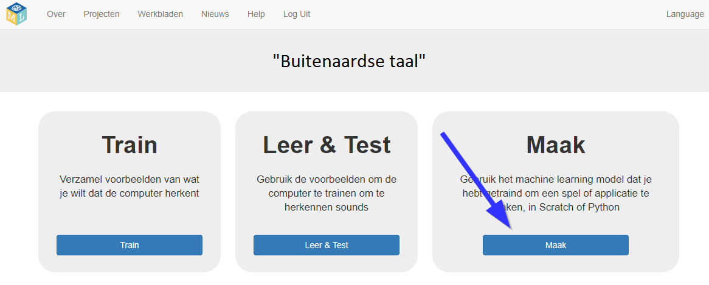
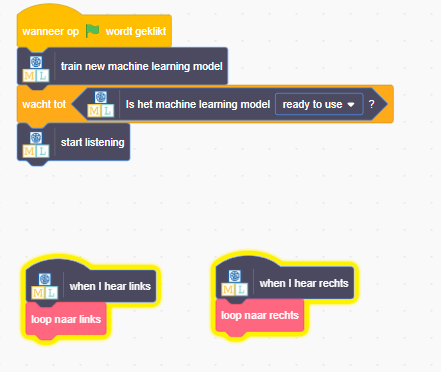

## Gebruik buitenaardse woorden in Scratch
In deze stap gebruik je je nieuwe machine learning-model in Scratch.

--- task ---

+ Klik op de knop **Maak**. 

+ Klik op de knop **Scratch 3** en klik vervolgens op **Open in Scratch 3**.

+ Klik op **Project templates** bovenaan het scherm en open vervolgens de projectsjabloon **Alien Language**.

---/task---

--- task ---

+ Kijk naar de scripts voor de alien-sprite. De scripts die er al zijn, zullen de alien sprite aan het begin op de juiste plaats zetten en animeren hoe het loopt. Verwijder ze niet. Voeg het onderstaande script toe aan de alien-sprite, onder de scripts die er al zijn. 

+ Test nu je programma! Klik op de groene vlag. Zeg je woorden (of maak je geluiden) voor 'links' en 'rechts' om de alien te vertellen welke weg hij moet bewandelen.

--- /task ---

Je hebt nu je eigen machine learning-model getraind om spraakherkenning te doen en dat gebruikt om een karakter in Scratch te besturen. In tegenstelling tot het model dat je eerder in het project hebt gebruikt, dat was getraind om tienduizenden woorden te herkennen, heb je het alleen getraind om twee verschillende woorden te herkennen. Het principe is echter hetzelfde.

Je hebt ook het belang ingezien van het trainen van het machine learning-model om met een bepaald achtergrondgeluid te werken.

--- task ---

Kun je een voorbeeld van een dergelijk systeem bedenken dat je eerder hebt gezien? Sommige auto's gebruiken bijvoorbeeld spraakherkenningssystemen die zijn getraind om de verschillende opdrachten te herkennen die je aan de computer in de auto kunt geven. Welke andere voorbeelden heb je gebruikt?

--- /task ---
