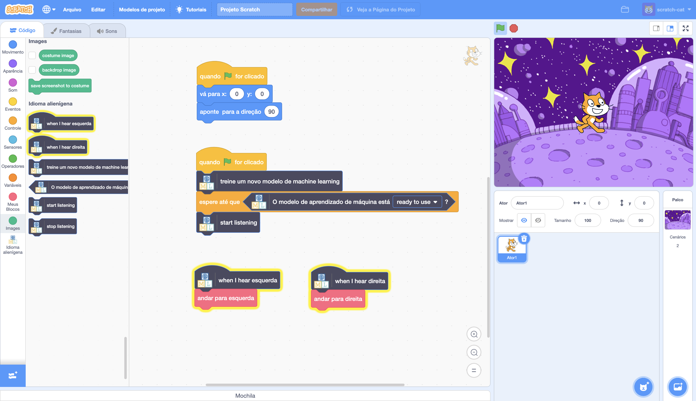

## Introdução

Neste projeto, você treinará o computador para entender uma língua alienígena. Você a usará para controlar um personagem alienígena, para que ele possa entender o que você manda fazer.

### O que você vai fazer

--- no-print ---

--- /no-print ---

--- print-only ---

--- /print-only ---

--- collapse ---
---
title: O que você vai precisar
---

+ Um computador com microfone

+ Acesso à internet

--- /collapse ---

--- collapse ---
---
title: O que você vai aprender
---
+ Como usar a extensão Fala para texto no Scratch 3 com um modelo pré-treinado
+ Como treinar um modelo de aprendizado de máquina para reconhecer sons
+ Como usar o modelo de aprendizado de máquina treinado no Scratch 3

--- /collapse ---

--- collapse ---
---
title: Informações adicionais para educadores
---

Se você precisar imprimir este projeto, por favor, use a [versão para impressão](https://projects.raspberrypi.org/pt-BR/projects/alien-language/print){:target="_blank"}.

--- /collapse ---

### Licença

Este projeto tem duas licenças sob uma licença [para compartilhamento não comercial de atribuição Creative Commons](http://creativecommons.org/licenses/by-nc-sa/4.0/){:target="_blank"} e uma [licença Apache versão 2.0](http://www.apache.org/licenses/LICENSE-2.0){:target="_blank"}

Gostaríamos de agradecer a Dale do machinelearningforkids.co.uk por todo o seu trabalho neste projeto.
