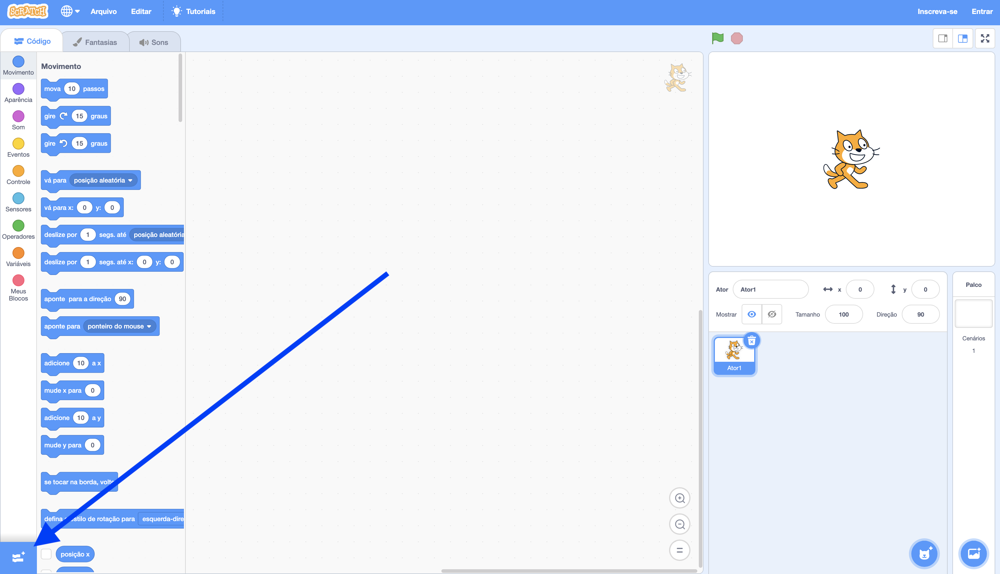
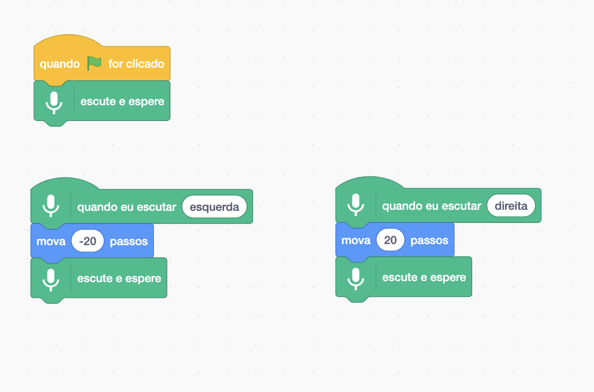
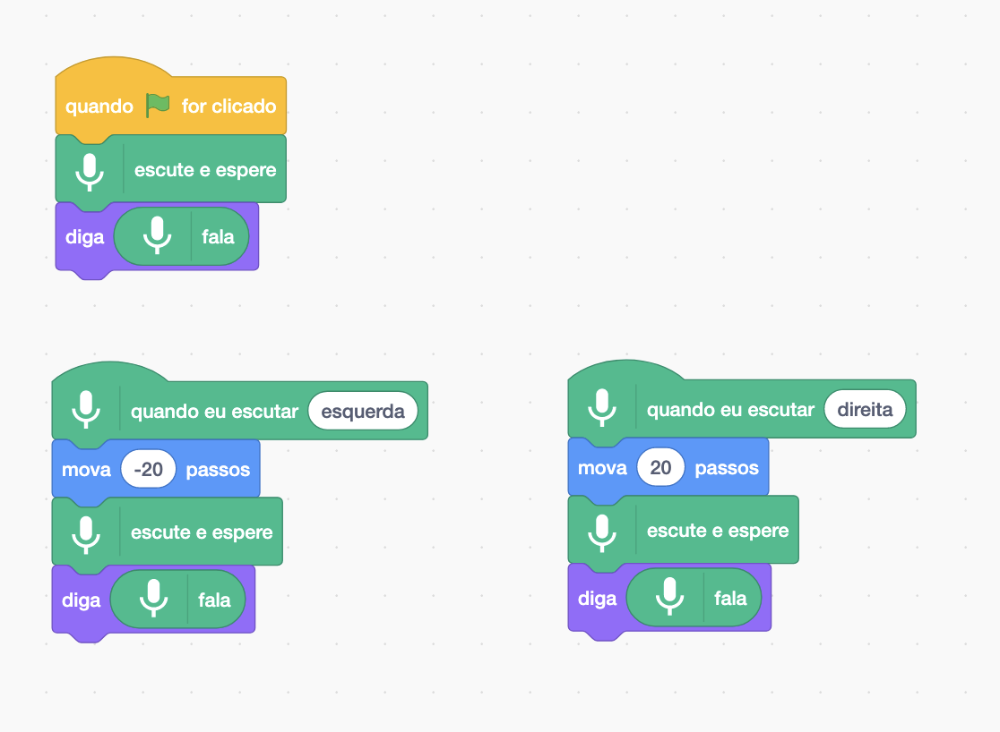

## Use um modelo pré-treinado

--- task ---
+ Vá para [machinelearningforkids.co.uk/scratch3](https://machinelearningforkids.co.uk/scratch3/){:target="_blank"}
--- /task ---

**Aviso:** Esta etapa do projeto só pode ser concluída usando o navegador Google Chrome. Se este navegador não estiver disponível para você, por favor, pule para [etapa 3: Criar um novo projeto](https://projects.raspberrypi.org/pt-BR/projects/alien-language/3)

--- task ---
+ Em seguida, carregue a extensão **Fala para Texto**. Clique no botão **Extensões** no canto inferior esquerdo e, em seguida, escolha **Fala para texto** na lista. **Nota:** Certifique-se de selecionar a extensão **Fala para texto**, não a extensão **Texto para fala**. 

+ Use blocos de **Eventos**, blocos de **Movimento** e os novos blocos **Fala para Texto** para criar os seguintes scripts. 

--- /task ---

--- task ---
Clique na bandeira verde para testar seu programa. Diga "esquerda" ou "direita". O gato do Scratch deve se mover na direção que você disser para ele ir. Use sua voz para tentar mover o gato do Scratch para frente e para trás na tela. Tente falar com calma e clareza.

Pode ser difícil fazer funcionar. Se não funcionar, adicione os blocos `diga` para que seu código se pareça com o código abaixo, para mostrar o que ele acha que você está dizendo. 

--- /task ---

Você agora usou o reconhecimento de fala para controlar um personagem no Scratch.

Nesta etapa, para que seu programa funcione rapidamente, você utilizou um modelo de aprendizado de máquina que já havia sido treinado para você. É um modelo geral de aprendizado de máquina que foi treinado para reconhecer palavras no dicionário inglês. 
