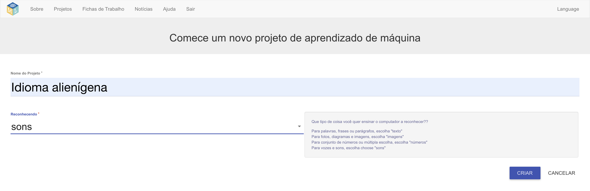

## Crie um novo projeto
Nas próximas etapas, você treinará um modelo de aprendizado de máquina para ver como isso foi feito. Para a próxima parte do projeto, você usará sua voz para controlar um personagem alienígena que não entende inglês! Você irá inventar duas novas palavras que não seriam encontradas em um dicionário de inglês. Então, você usará as palavras para controlar o personagem alienígena e treinará um modelo de aprendizado de máquina para reconhecê-lo.

Primeiro, acesse o site Machine Learning for Kids e crie um projeto.

--- task ---
+ Vá para [machinelearningforkids.co.uk](https://machinelearningforkids.co.uk/){:target="_blank"}.

+ Clique em **Primeiros passos**.

+ Clique em **Experimente agora**.
--- /task ---

--- task ---
+ Clique em **Projetos** na barra de menus na parte superior da página.

+ Clique no botão **Adicionar um novo projeto**.

+ Nomeie seu projeto como `Idioma Alienígena` e defina-o para aprender a reconhecer `sons`. Em seguida, clique no botão **Criar**. 

+ Você deve ver `Idioma Alienígena` na lista de projetos. Clique no projeto `Idioma Alienígena`.
--- /task ---
