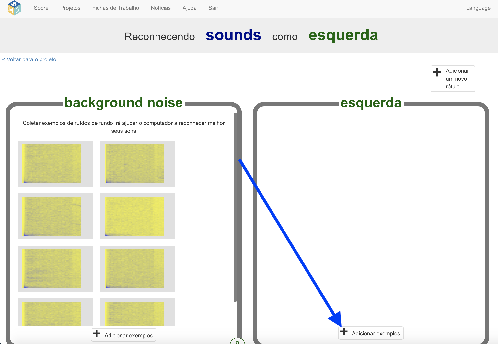

## Crie palavras alienígenas
Nesta etapa, você irá inventar suas palavras alienígenas.

--- task ---

Você precisa de duas palavras - uma palavra alienígena para "esquerda" e uma palavra alienígena para "direita". Invente duas novas palavras que não estariam em um dicionário de inglês. Eles podem ser barulhos aleatórios, desde que você possa repeti-los da mesma maneira todas as vezes e eles sejam reconhecidamente diferentes um do outro. Se você não quiser fazer barulhos com a sua voz, tudo bem - você pode encontrar outras maneiras de fazer barulhos. Você pode clicar nos dedos, bater palmas, apertar um brinquedo estridente ou fazer qualquer outra coisa que puder imaginar! Tenha certeza que você vai lembrar de suas novas palavras!

--- /task ---

--- task ---

+ Clique no botão **Treinar** para começar a coletar exemplos. 

+ Clique no botão **Adicionar exemplo** na caixa **background noise**. A gravação do ruído de fundo ajudará seu modelo de aprendizado de máquina a diferenciar os sons que você o treinará para reconhecer e o ruído de fundo onde você está. 

+ Clique no microfone para gravar 2 segundos de ruído de fundo. 

+ Clique no botão **Adicionar** para salvar sua gravação. 

+ Repita essas etapas até ter **pelo menos 8 exemplos** de ruído de fundo. 

--- /task ---

--- task ---

+ Clique no botão **Adicionar um novo rótulo** no canto superior direito e crie uma nova caixa de treinamento chamada `esquerda`. 

+ Clique no botão **Adicionar exemplo** na nova **caixa esquerda**. 

+ Registre **pelo menos 8 exemplos** da sua palavra alienígena para "esquerda". 

--- /task ---

--- task ---

+ Clique no botão **Adicionar novo rótulo** no canto superior direito novamente e crie uma nova caixa de treinamento chamado `direita`.

+ Clique no botão **Adicionar exemplo** na nova caixa **direita**.

+ Registre **pelo menos 8 exemplos** da sua palavra estrangeira para “direita”. 

+ **Nota:** No final desta etapa, você deve ter oito exemplos em cada uma das caixas.

--- /task ---
