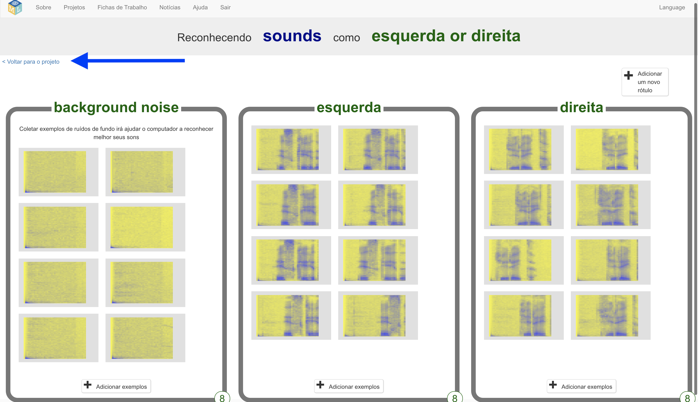
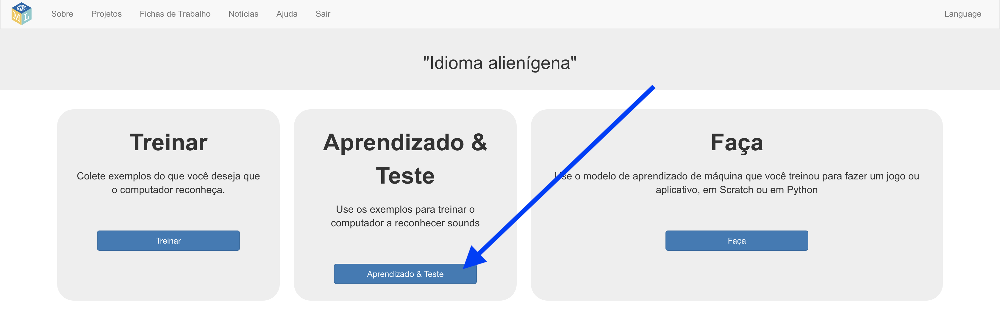
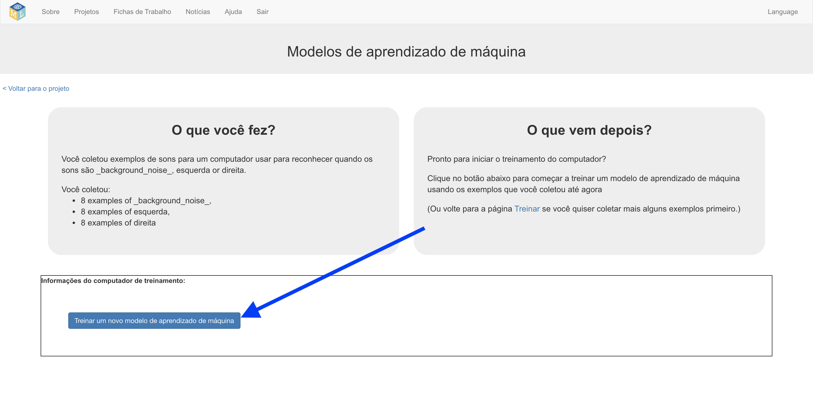
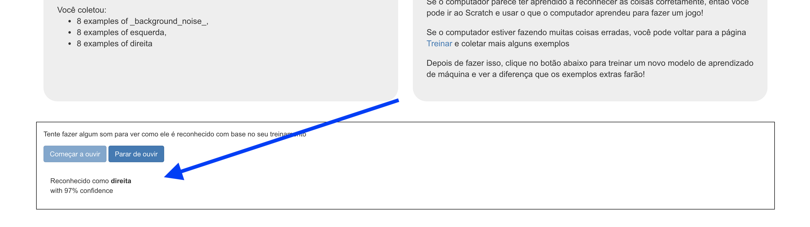

## Treine um novo modelo de aprendizado de máquina
Nesta etapa, você usará os exemplos que você coletou na última etapa para treinar o computador a reconhecer suas novas palavras.

---  task ---

+ Clique no link **Voltar ao projeto** no canto superior esquerdo. 

+ Clique no botão **Aprendizado & Teste**. 

+ Clique em **Treinar um novo modelo de aprendizado de máquina**. Isso pode levar alguns minutos para ser concluído. 

--- /task ---

--- task ---

+ Depois que o treinamento terminar, clique no botão **Começar a ouvir** para testar seu modelo de aprendizado de máquina. Diga uma das palavras (ou faça um dos sons) que você treinou no computador para reconhecer como "esquerda" ou "direita". Se o seu modelo de aprendizado de máquina o reconhecer, ele exibirá o que acha que você disse. 

+ Se você não estiver satisfeito com o funcionamento do modelo, volte à página **Treinar** e adicione mais exemplos aos três intervalos de treinamento.

+ Quando estiver satisfeito com seu modelo de aprendizado de máquina, passe para a próxima etapa.

--- /task ---
