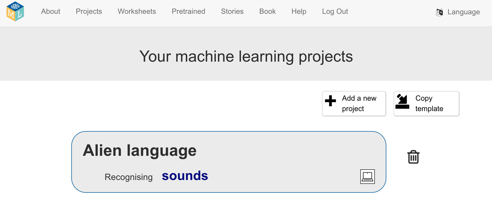

## Prepara o teu projeto

<html>
  

    <iframe style="position: absolute; top: 0; left: 0; right: 0; width: 100%; height: 100%; border: none;" src="https://www.youtube.com/embed/F4HePu4SNrs?rel=0&cc_load_policy=1" allowfullscreen allow="accelerometer; autoplay; clipboard-write; encrypted-media; gyroscope; picture-in-picture; web-share"></iframe>
  

</html>

--- task ---

+ Vai para [https://machinelearningforkids.co.uk](https://machinelearningforkids.co.uk/){:target="_blank"} num navegador web.

+ Clica em **Começar**.

+ Clica em **Experimente agora**.

--- /task ---

--- task ---

+ Clica em **Projetos** na barra do menu na parte superior.

+ Clica no botão **+ Adicionar um novo projeto**.

+ Dá nome ao teu projeto `Linguagem extraterrestre` e configura-o para aprender a reconhecer **sons**, e armazenar os dados **no teu navegador web**. E clica em **Criar**. 

+ Agora, deves ver 'Linguagem Extraterrestre' na tua lista de projetos. Clica no projeto. 

--- /task ---

--- task ---

+ Clica no botão **Treinar**. 

+ Se vires uma mensagem pop-up a pedir permissão para usar o microfone, clica em **Permitir em todas as visitas**.

--- /task ---

