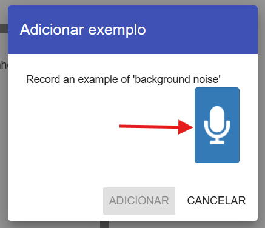
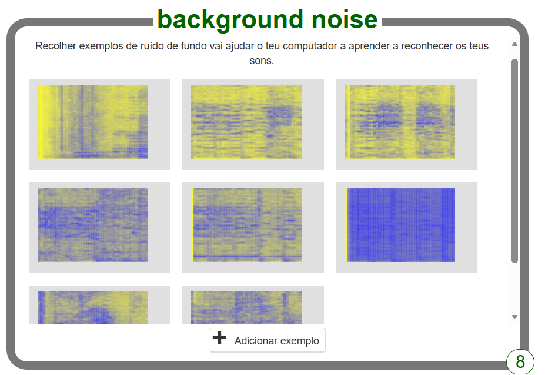

## Inventa duas palavras

<html>
  

    <iframe style="position: absolute; top: 0; left: 0; right: 0; width: 100%; height: 100%; border: none;" src="https://www.youtube.com/embed/au4cDSYW_EQ?rel=0&cc_load_policy=1" allowfullscreen allow="accelerometer; autoplay; clipboard-write; encrypted-media; gyroscope; picture-in-picture; web-share"></iframe>
  

</html>

Primeiro, vais recolher amostras do ruído de fundo. Isto vai ajudar o teu modelo de machine learning a distinguir entre os sons que o vais treinar a reconhecer e o ruído de fundo do local onde estás.

--- task ---

+ Clica no botão **+ Adicionar exemplos** em **background noise**.

+ Clica no microfone, mas não digas nada. Grava 2 segundos de ruído de fundo. 

+ Clica no botão **Adicionar** para guardar a tua gravação.

--- /task ---

--- task ---

+ Repete estes passos até teres **pelo menos 8 exemplos** de ruído de fundo. 

--- /task ---

Inventa duas palavras extraterrestres — uma palavra que signifique "esquerda" e outra palavra que signifique "direita".

Agora vais gravar oito exemplos de cada palavra para que o teu modelo de machine learning possa aprender a reconhecê-las.

--- task ---

+ Clica em **+ Adicionar novo rótulo** no canto superior direito do ecrã e adiciona um rótulo chamado `esquerda`.

--- /task ---

--- task ---

+ Clica em **+ Adicionar exemplos** na caixa para o novo rótulo `esquerda`, e grava-te a dizer a tua palavra extraterrestre para "esquerda".

+ Repete até teres registado **pelo menos oito exemplos**.

--- /task ---

--- task ---

+ Clica em **+ Adicionar novo rótulo** para criar outro rótulo chamado `direita` e regista oito exemplos da tua palavra extraterrestre para "direita".

--- /task ---
