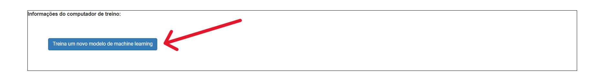
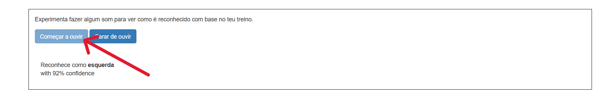

## Treina o modelo

<html>
  

    <iframe style="position: absolute; top: 0; left: 0; right: 0; width: 100%; height: 100%; border: none;" src="https://www.youtube.com/embed/o4J5c0o5lVE?rel=0&cc_load_policy=1" allowfullscreen allow="accelerometer; autoplay; clipboard-write; encrypted-media; gyroscope; picture-in-picture; web-share"></iframe>
  

</html>

Reuniste os exemplos de que precisas, e agora vais usar estes exemplos para treinar o teu modelo de machine learning.

--- task ---

+ Clica em **< Voltar para o projeto** no canto superior esquerdo.

+ Clica em **Aprender & Testar**.

+ Clica no botão chamado **Treinar um novo modelo de Machine Learning**. Isto pode levar alguns minutos até terminar. 

--- /task ---

Quando o treino acabar, podes testar o quão bem o teu modelo reconhece as palavras extraterrestres que inventaste.

--- task ---

+ Clica no botão **Começar a ouvir** e diz a tua palavra extraterrestre para "esquerda".

Se o teu modelo de machine learning a reconhecer, vai exibir a previsão do que disseste. 

+ Testa se o modelo também reconhece a tua palavra extraterrestre para "direita".

--- /task ---

Se não ficares satisfeito com o funcionamento do modelo, volta à página **Treinar** e adiciona mais exemplos, depois treina o modelo outra vez.

