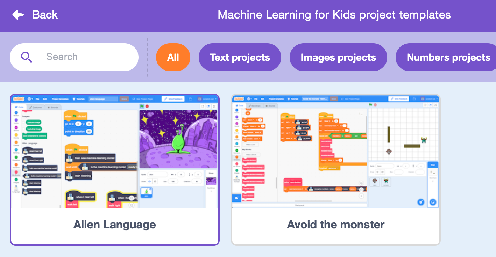
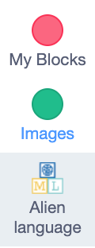

## Controla o extraterrestre

<html>
  

    <iframe style="position: absolute; top: 0; left: 0; right: 0; width: 100%; height: 100%; border: none;" src="https://www.youtube.com/embed/cAovIpUuiGo?rel=0&cc_load_policy=1" allowfullscreen allow="accelerometer; autoplay; clipboard-write; encrypted-media; gyroscope; picture-in-picture; web-share"></iframe>
  

</html>

Agora que o teu modelo consegue distinguir as palavras, podes usá-lo no programa Scratch para movimentar o extraterrestre.

--- task ---

+ Clica no link **< Voltar para o projeto**.

+ Clica em **Criar**.

+ Clica em **Scratch 3**.

+ Clica em **Abrir no Scratch 3**.

--- /task ---

--- task ---

+ Clica em **Project templates** na parte superior e seleciona o projeto 'Alien language' para carregar o ator extraterrestre, que já tem algum código adicionado.

--- /task ---

Machine learning for Kids adicionou alguns blocos especiais ao Scratch para permitir que utilizes o modelo que acabaste de treinar. Este modelo de projeto contém também blocos especiais 'walk left' e 'walk right' dentro de "Os Meus Blocos". Encontras ambos na última parte da lista de blocos.

--- task ---

+ Certifica-te que tens o ator **Extraterrestre** selecionado, depois clica no separador **Código** e adiciona este código. (Mantém o código que já existe!) 

--- /task ---

--- task ---

+ Clica na **bandeira verde** e diz as tuas palavras extraterrestres para "esquerda" e "direita". Verifica se o extraterrestre se move na direção que estás à espera.

--- /task ---

