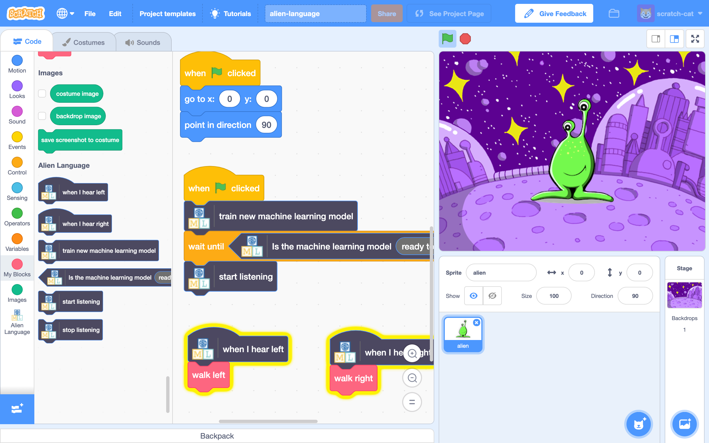

## Introduction

In this project, you will train the computer to understand an alien language. You will use that to control an alien character so that it can understand what you tell it to do.

### What you will make

--- no-print ---

--- /no-print ---

--- print-only ---

--- /print-only ---

--- collapse ---
---
title: What you will need
---

+ A computer with a microphone

+ Internet access

--- /collapse ---

--- collapse ---
---
title: What you will learn
---
+ How to use the Speech to Text extension in Scratch 3 with a pretrained model
+ How to train a machine learning model to recognise sounds
+ How to use your trained machine learning model in Scratch 3

--- /collapse ---

--- collapse ---
---
title: Additional information for educators
---

If you need to print this project, please use the [printer-friendly version](https://projects.raspberrypi.org/en/projects/alien-language/print){:target="_blank"}.

--- /collapse ---

### Licence

This project is dual-licensed under both a [Creative Commons Attribution Non-Commercial Share-Alike License](http://creativecommons.org/licenses/by-nc-sa/4.0/){:target="_blank"} and an [Apache License Version 2.0](http://www.apache.org/licenses/LICENSE-2.0){:target="_blank"}

We'd like to thank Dale from machinelearningforkids.co.uk for all his work on this project.
