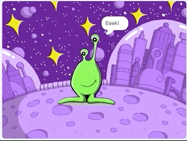

## Ne yapacaksınız

Uzaylı bir dili tanımak için bir makine öğrenme modeli eğitin ve bunu Scratch'te kullanarak bir uzaylıyı kontrol edin.

Bir **mikrofona** ihtiyacınız olacak.

--- yıkılma ---

---
başlık: Sesli komutlarım nerede saklanıyor?
---

- Bu proje 'makine öğrenimi' adı verilen bir teknolojiyi kullanıyor. Makine öğrenimi sistemleri büyük miktarda veri kullanılarak eğitilir.
- Bu proje için hesap oluşturmanız veya giriş yapmanız gerekmiyor. Bu proje için, modeli oluşturmak üzere kullandığınız resim örnekleri yalnızca geçici olarak tarayıcınızda (yalnızca bilgisayarınızda) saklanır.

--- /yıkılma ---

--- yıkılma ---
---
başlık: YouTube hesabınız yok mu? Videoları indirin!
---

Bu projeye ait tüm videoları [indirebilirsiniz](https://rpf.io/p/en/alien-language-go){:target="_blank"}.

--- /yıkılma ---

--- yıkılma ---
---
başlık: Lisans
---

Bu proje hem [Creative Commons Attribution Non-Commercial Share-Alike Lisansı](http://creativecommons.org/licenses/by-nc-sa/4.0/){:target="_blank"} hem de [Apache Lisansı Sürüm 2.0](http://www.apache.org/licenses/LICENSE-2.0){:target="_blank"} kapsamında çift lisanslıdır.

Bu projedeki tüm çalışmaları için machinelearningforkids.co.uk'den Dale'e teşekkür etmek istiyoruz.

--- /yıkılma ---

