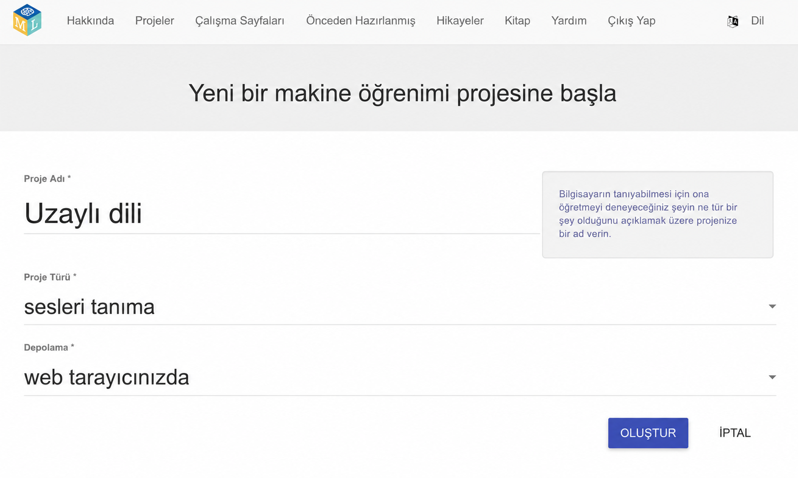
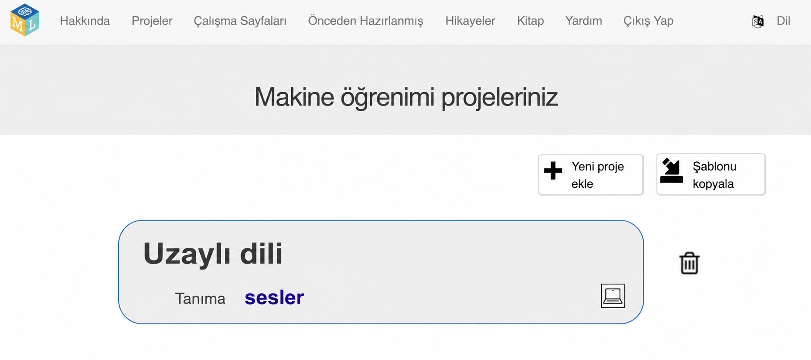
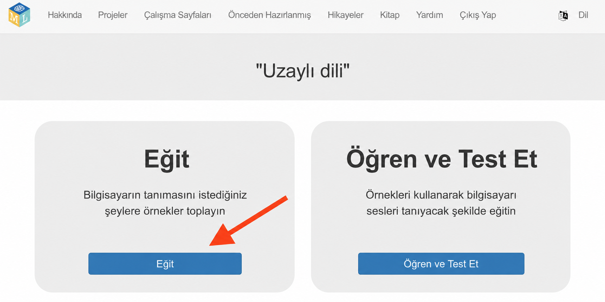
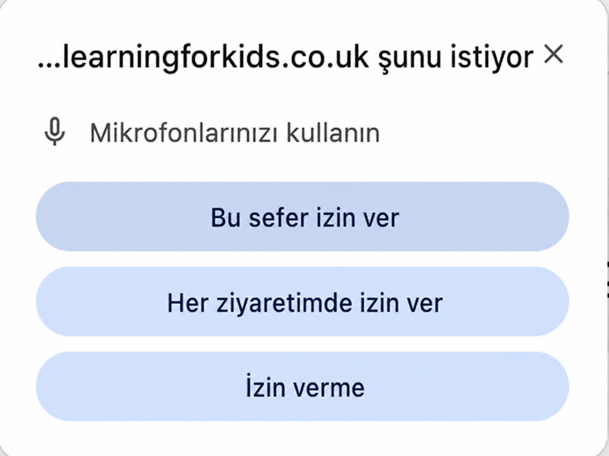

## Projeyi kurun

<html>
  

    <iframe style="position: absolute; top: 0; left: 0; right: 0; width: 100%; height: 100%; border: none;" src="https://www.youtube.com/embed/F4HePu4SNrs?rel=0&cc_load_policy=1" allowfullscreen allow="accelerometer; autoplay; clipboard-write; encrypted-media; gyroscope; picture-in-picture; web-share"></iframe>
  

</html>

--- görev ---

+ Bir web tarayıcısında [machinelearningforkids.co.uk](https://machinelearningforkids.co.uk/){:target="_blank"} adresine gidin.

+ **Başla**seçeneğine tıklayın.

+ **Şimdi dene**ye tıklayın.

--- /görev ---

--- görev ---

+ Üstteki menü çubuğunda **Projeler**'e tıklayın.

+ **+ Yeni bir proje ekle** düğmesine tıklayın.

+ Projenize `Uzaylı dili` adını verin ve **sesleri**tanımayı öğrenmesi için ayarlayın ve verileri **web tarayıcınızda** saklayın. Ardından **Oluştur** seçeneğine tıklayın. 

+ Artık projeler listesinde 'Uzaylı dili'ni görmelisiniz. Projeye tıklayın. 

--- /görev ---

--- görev ---

+ **Eğit** düğmesine tıklayın. 

+ Mikrofonu kullanmak için bir açılır pencere mesajı görürseniz, **Her ziyarette izin ver** seçeneğine tıklayın.

--- /görev ---

