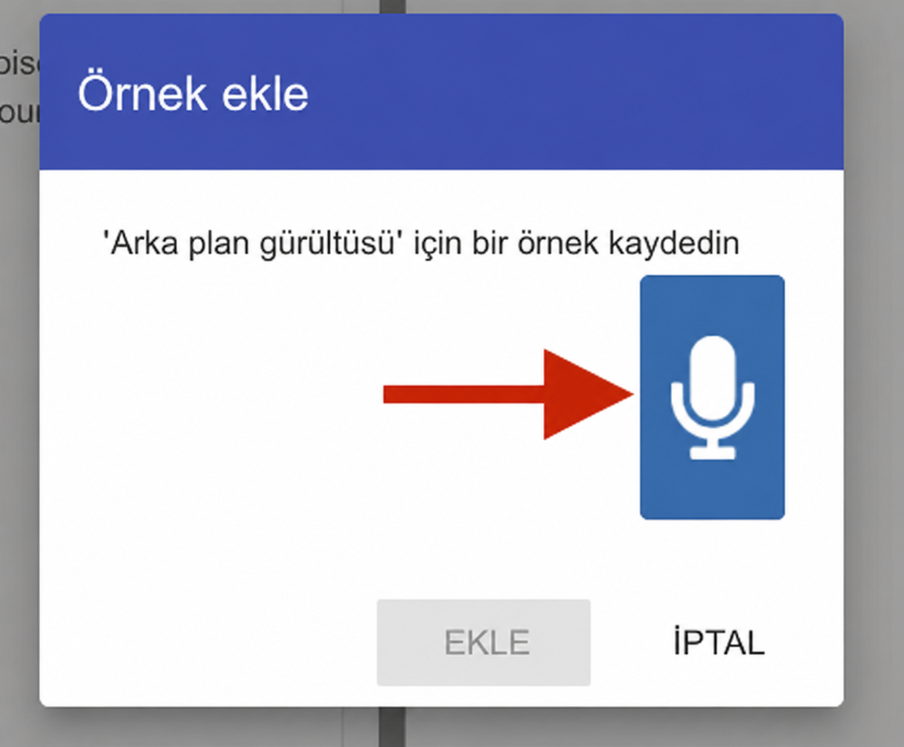
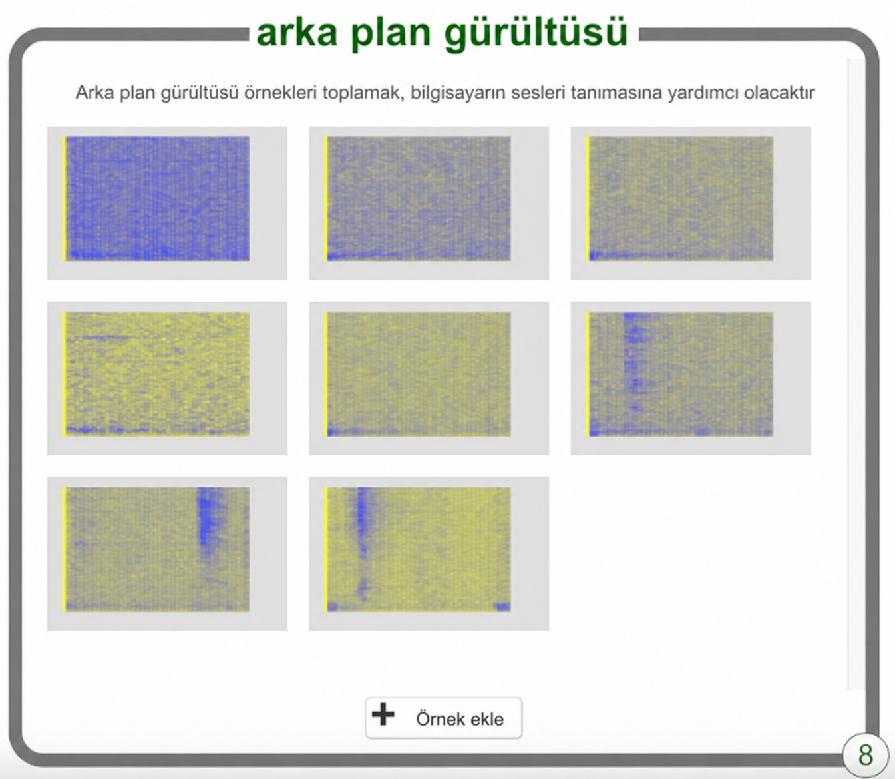

## İki kelime uydurun

<html>
  

    <iframe style="position: absolute; top: 0; left: 0; right: 0; width: 100%; height: 100%; border: none;" src="https://www.youtube.com/embed/au4cDSYW_EQ?rel=0&cc_load_policy=1" allowfullscreen allow="accelerometer; autoplay; clipboard-write; encrypted-media; gyroscope; picture-in-picture; web-share"></iframe>
  

</html>

Öncelikle, arka plan gürültüsü örnekleri toplayacaksınız. Bu, makine öğrenimi modelinizin, tanıması için eğittiğiniz sesler ile bulunduğunuz ortamdaki arka plan gürültüsü arasındaki farkı ayırt etmesine yardımcı olacaktır.

--- görev ---

+ **arka plan gürültüsü** içindeki **+ Örnek ekle** düğmesine tıklayın.

+ Mikrofona tıklayın ama hiçbir şey söylemeyin. 2 saniye boyunca arka plan gürültüsü kaydedin. 

+ Kaydınızı kaydetmek için **Ekle** düğmesine tıklayın.

--- /görev ---

--- görev ---

+ **En az sekiz adet arka plan gürültüsü örneği** elde edene kadar bu adımları tekrarlayın. 

--- /görev ---

İki yabancı kelime icat edin — biri "sol" anlamına gelen bir kelime, diğeri "sağ" anlamına gelen bir kelime.

Şimdi, makine öğrenme modelinizin bunları tanımayı öğrenmesi için her kelimeden sekiz örnek kaydedeceksiniz.

--- görev ---

+ Ekranın sağ üst köşesindeki **+ Yeni etiket ekle** seçeneğine tıklayın ve `sol` adında bir etiket ekleyin.

--- /görev ---

--- görev ---

+ Yeni `sol` etiketi için kutunun içindeki **+ Örnek ekle** seçeneğine tıklayın ve `sol` kelimesini söylerken kendinizi kaydedin.

+ **En az sekiz örnek** kaydedene kadar tekrarlayın.

--- /görev ---

--- görev ---

+ **+ Yeni etiket ekle** seçeneğine tıklayarak `sağ` adlı başka bir etiket oluşturun ve "sağ" için uzaylı kelimenizin sekiz örneğini kaydedin.

--- /görev ---
