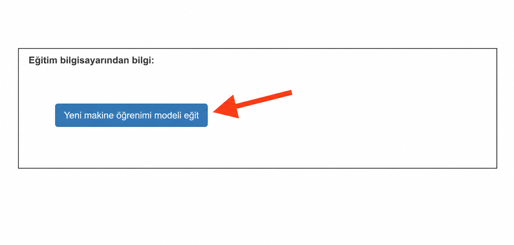
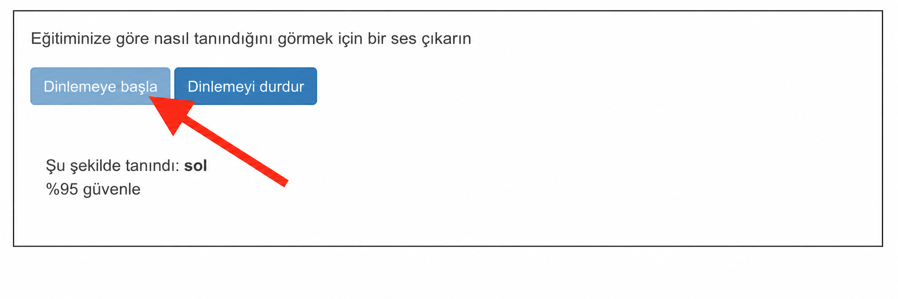

## Modeli eğitin

<html>
  

    <iframe style="position: absolute; top: 0; left: 0; right: 0; width: 100%; height: 100%; border: none;" src="https://www.youtube.com/embed/o4J5c0o5lVE?rel=0&cc_load_policy=1" allowfullscreen allow="accelerometer; autoplay; clipboard-write; encrypted-media; gyroscope; picture-in-picture; web-share"></iframe>
  

</html>

İhtiyacınız olan örnekleri topladınız, şimdi bu örnekleri kullanarak makine öğrenimi modelinizi eğiteceksiniz.

--- görev ---

+ Sol üst köşedeki **Projeye geri dön** seçeneğine tıklayın.

+ **Öğren & Test et** üzerine tıklayın.

+ **Yeni makine öğrenimi modeli eğit** etiketli düğmeye tıklayın. Bu işlem birkaç dakika sürebilir. 

--- /görev ---

Eğitim tamamlandıktan sonra, modelinizin icat ettiğiniz uzaylı kelimeleri ne kadar iyi tanıdığını test edebilirsiniz.

--- görev ---

+ **Dinlemeye Başla** düğmesine tıklayın, ardından "sol" için uzaylı kelimenizi söyleyin.

Makine öğrenme modeliniz bunu tanırsa, ne söylediğinizi tahmin ederek ekranda gösterecektir.

+ Modelin, yabancı dilde yazdığınız "sağ" kelimesini de tanıyıp tanımadığını test edin.

--- /görev ---

Modelin çalışma şeklinden memnun değilseniz, **Eğit** sayfasına geri dönün, daha fazla örnek ekleyin ve modelinizi tekrar eğitin.

