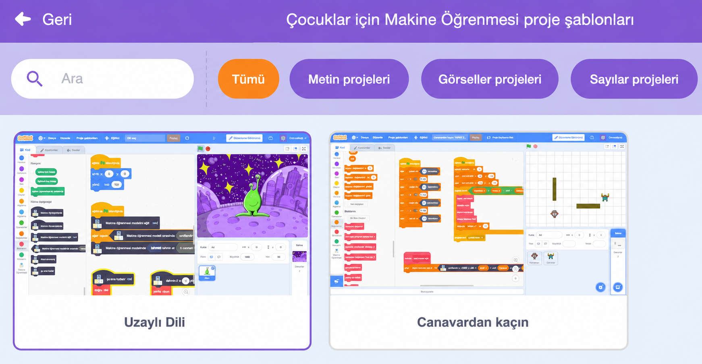
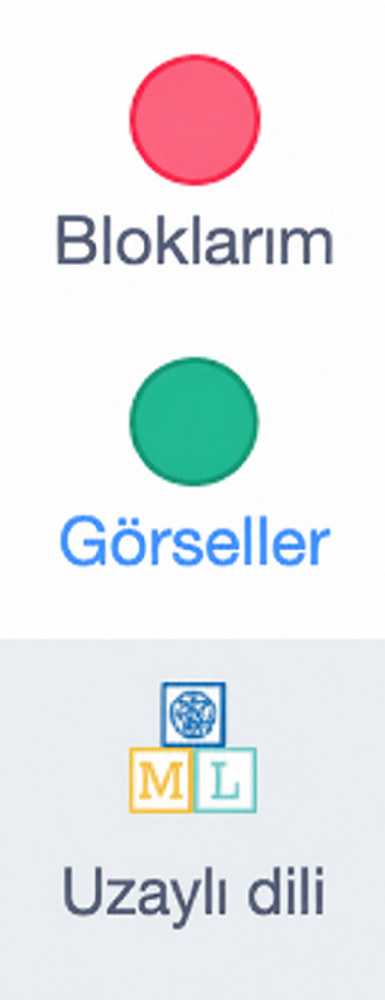
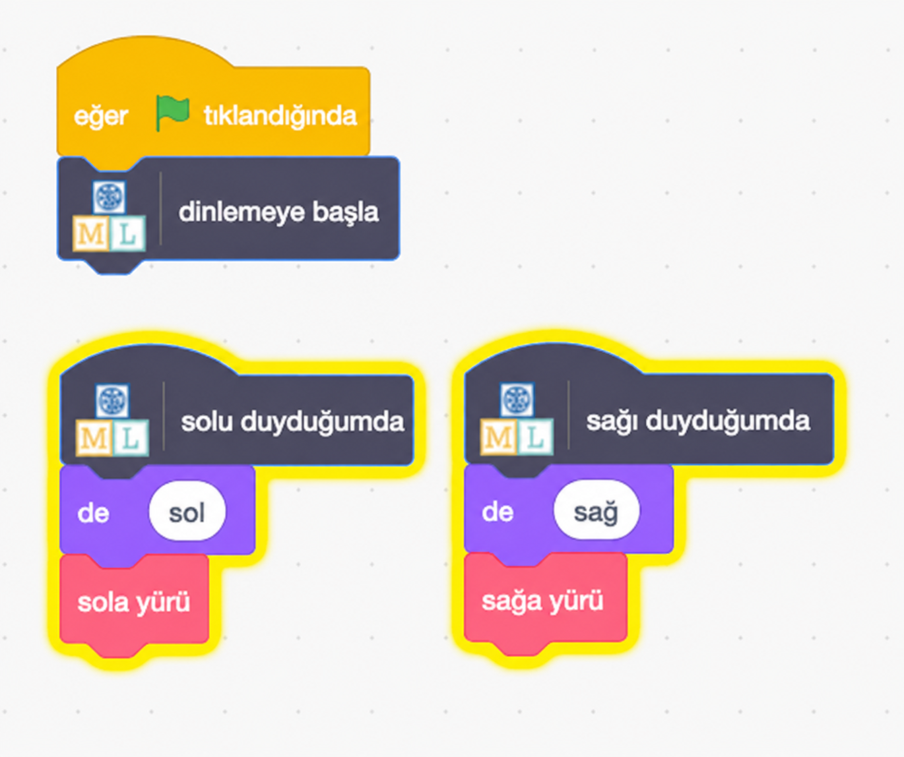

## Uzaylıyı kontrol edin

<html>
  

    <iframe style="position: absolute; top: 0; left: 0; right: 0; width: 100%; height: 100%; border: none;" src="https://www.youtube.com/embed/cAovIpUuiGo?rel=0&cc_load_policy=1" allowfullscreen allow="accelerometer; autoplay; clipboard-write; encrypted-media; gyroscope; picture-in-picture; web-share"></iframe>
  

</html>

Modeliniz artık kelimeleri ayırt edebildiğine göre, onu bir Scratch programında kullanarak bir uzaylıyı kontrol edebilirsiniz.

--- görev ---

+ **< Projeye geri dön** bağlantısına tıklayın.

+ **Yap** düğmesine basın.

+ **Scratch 3** düğmesine basın.

+ **Scratch 3'te Aç** seçeneğine tıklayın.

--- /görev ---

--- görev ---

+ En üstteki **Proje şablonları** seçeneğine tıklayın ve içine bazı kodlar eklenmiş olan uzaylı karakterini yüklemek için 'Uzaylı dili' projesini seçin.

--- /görev ---

Çocuklar için Makine Öğrenimi, yeni eğittiğiniz modeli kullanmanıza olanak sağlamak için Scratch'e bazı özel bloklar ekledi. Bu proje şablonu ayrıca "Bloklarım" bölümünde özel "sola yürü" ve "sağa yürü" blokları da içermektedir. Onları blok listesinin en altında bulabilirsiniz.

--- görev ---

+ **Uzaylı** karakterini seçtiğinizden emin olun, ardından **Kod** sekmesine tıklayın ve bu kodu ekleyin. (Mevcut kodu olduğu gibi bırakın!) 

--- /görev ---

--- görev ---

+ **yeşil bayrağa** tıklayın ve "sol" ve "sağ" için uzaylı kelimelerinizi söyleyin. Uzaylının beklediğiniz gibi hareket ettiğinden emin olun.

--- /görev ---

