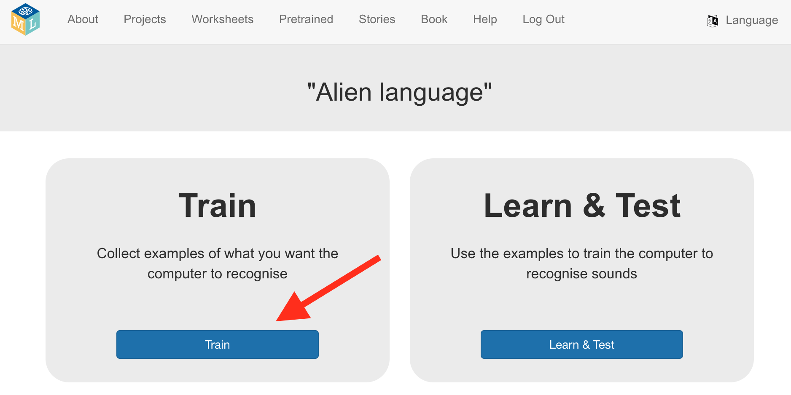

## Створи проєкт

<html>
  

    <iframe style="position: absolute; top: 0; left: 0; right: 0; width: 100%; height: 100%; border: none;" src="https://www.youtube.com/embed/F4HePu4SNrs?rel=0&cc_load_policy=1" allowfullscreen allow="accelerometer; autoplay; clipboard-write; encrypted-media; gyroscope; picture-in-picture; web-share"></iframe>
  

</html>

--- task ---

+ Перейди до [machinelearningforkids.co.uk](https://machinelearningforkids.co.uk/){:target="_blank"} у браузері.

+ Натисни на **Почати**.

+ Натисни на **Спробуйте зараз**.

--- /task ---

--- task ---

+ Натисни на **Проєкти** в меню угорі.

+ Натисни на кнопку **+ Додати новий проєкт**.

+ Назви свій проєкт `Мова інопланетян` і налаштуй його для **розпізнавання звуку** зі **збереженням даних у браузері**. Тепер натисни на **Створити**. 

+ Тепер ти маєш бачити проєкт «Мова інопланетян» у переліку. Натисни на проєкт. 

--- /task ---

--- task ---

+ Натисни на кнопку **Навчити**. 

+ Якщо побачиш вікно із запитом на використання мікрофону, натисни **Дозволити під час кожного відвідування**.

--- /task ---

