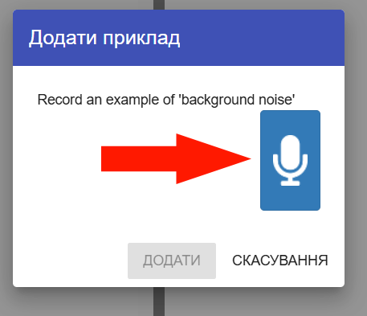
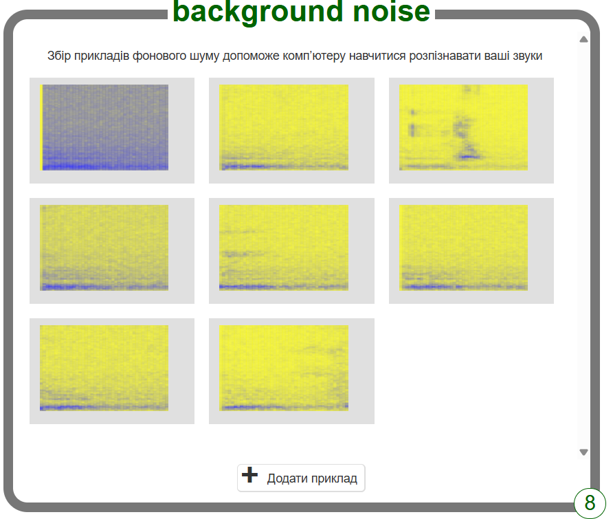

## Вигадай два слова

<html>
  

    <iframe style="position: absolute; top: 0; left: 0; right: 0; width: 100%; height: 100%; border: none;" src="https://www.youtube.com/embed/au4cDSYW_EQ?rel=0&cc_load_policy=1" allowfullscreen allow="accelerometer; autoplay; clipboard-write; encrypted-media; gyroscope; picture-in-picture; web-share"></iframe>
  

</html>

Перш за все, ти збереш зразки фонового шуму. Це допоможе твій моделі машинного навчання відрізняти звуки, на яких ти її тренуватимеш, від фонового шуму твого місця знаходження.

--- task ---

+ Натисни на кнопку **+ Додати приклад** у панелі **background noise** (фоновий шум).

+ Натисни на мікрофон, але нічого не кажи. Запиши 2 секунди фонового шуму. 

+ Натисни на кнопку **Додати**, щоб зберегти запис.

--- /task ---

--- task ---

+ Повторюй ці кроки, поки не матимеш **щонайменше вісім зразків** фонового шуму. 

--- /task ---

Придумай два слова інопланетною мовою: слово на позначення «ліворуч» і слово на позначення «праворуч».

Тепер ти запишеш приклади для кожного слова, щоб твоя модель машинного навчання могла їх розрізняти.

--- task ---

+ Натисни на **+ Додати нову мітку** у верхньому правому куті екрану і додай мітку з назвою `left` («ліворуч»).

--- /task ---

--- task ---

+ Натисни на **+ Додати приклад** у прямокутнику з міткою `left` і запиши, як ти промовляєш своє іншопланетне слово на позначення «ліворуч».

+ Повторюй, поки не матимеш **щонайменше вісім** зразків.

--- /task ---

--- task ---

+ Натисни на **+ Додати нову мітку**, щоб створити нову мітку з назвою `right` («праворуч»), і запиши вісім зразків іншопланетного слова на позначення «праворуч».

--- /task ---
