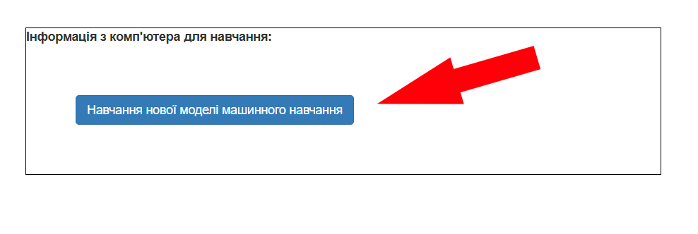
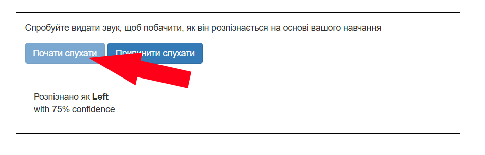

## Натренуй модель

<html>
  

    <iframe style="position: absolute; top: 0; left: 0; right: 0; width: 100%; height: 100%; border: none;" src="https://www.youtube.com/embed/o4J5c0o5lVE?rel=0&cc_load_policy=1" allowfullscreen allow="accelerometer; autoplay; clipboard-write; encrypted-media; gyroscope; picture-in-picture; web-share"></iframe>
  

</html>

Необхідні зразки зібрано! Тепер ти їх використаєш, щоб натренувати модель машинного навчання.

--- task ---

+ Натисни **Назад до проєкту** у верхньому лівому куті.

+ Натисни на **Навчити та перевірити**.

+ Натисни на кнопку з написом **Навчання нової моделі машинного навчання**. Це може зайняти декілька хвилин. 

--- /task ---

Щойно тренування завершено, можеш перевірити, наскільки добре твоя модель розпізнає іншопланетні слова.

--- task ---

+ Натисни на кнопку **Почати слухати** і скажи своє іншопланетне слово, що означає «ліворуч».

Якщо твоя модель машинного навчання розпізнала слово, вона покаже свій прогноз щодо цього слова. 

+ Також перевір, чи розпізнає твоя модель іношпланетне слово, що означає «праворуч».

--- /task ---

Якщо поведінка моделі не є задовільною, повернись на сторінку **Навчання** та додай більше зразків, а потім знову натренуй модель.

