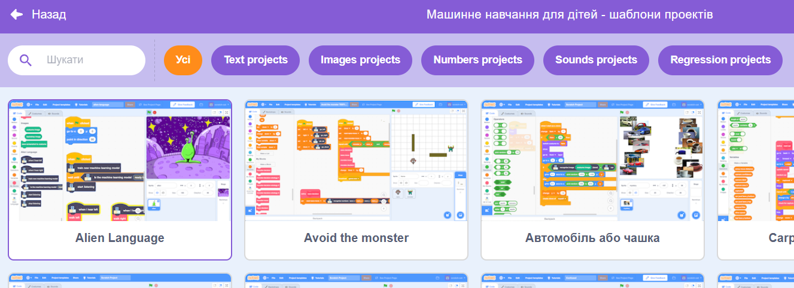
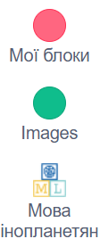

## Контролюй інопланетянина

<html>
  

    <iframe style="position: absolute; top: 0; left: 0; right: 0; width: 100%; height: 100%; border: none;" src="https://www.youtube.com/embed/cAovIpUuiGo?rel=0&cc_load_policy=1" allowfullscreen allow="accelerometer; autoplay; clipboard-write; encrypted-media; gyroscope; picture-in-picture; web-share"></iframe>
  

</html>

Тепер твоя модель може розрізняти два слова, і ти можеш її використати у програмі Скретч для керування прибульцем.

--- task ---

+ Натисни на **Назад до проєкту**.

+ Натисни на кнопку **Створити**.

+ Натисни на **Scratch 3**.

+ Натисни на **Відкрити в Scratch 3**.

--- /task ---

--- task ---

+ Натисни на **Шаблони проєктів** угорі та обери проєкт Alien Language («Мова інопланетян»), щоб завантажити спрайт прибульця, до якого вже додано певний код.

--- /task ---

Machine Learning for Kids додали до Скретчу деякі спеціальні блоки, які дозволяють використовувати щойно навчену модель. Цей шаблон проєкту також містить спеціальні блоки walk left («йти ліворуч») та walk right («йти праворуч») у категорії «Мої блоки». Знайди їх внизу списку блоків.

--- task ---

+ Обери спрайт інопланетянина (**Alien**), потім натисни на вкладку **Код** та додай це код. (Не видаляй код, який там уже є!) 

--- /task ---

--- task ---

+ Натисни на **зелений прапорець** і скажи свої іншопланетні слова, котрі означають «ліворуч» та «праворуч». Переконайся, що інопланетянин рухається, як треба.

--- /task ---

