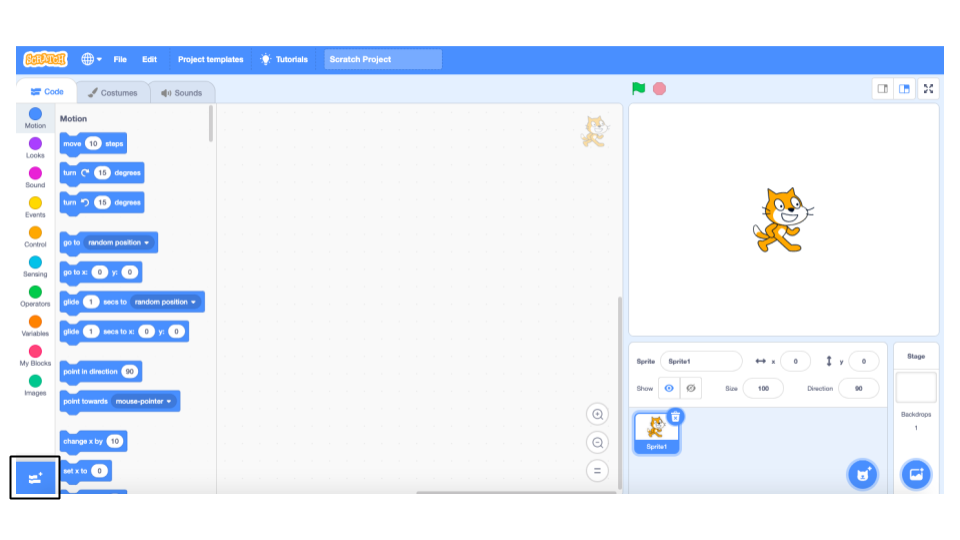

## 使用預先準備好的模型

--- task ---
+ 前往 [machinelearningforkids.co.uk/scratch3](https://machinelearningforkids.co.uk/scratch3/){:target=“_ blank”}
--- / task-

**警告：** 專案中的這個步驟只能在 Google Chrome 瀏覽器中執行。 如果你沒有這個瀏覽器，請跳到[步驟3：創造新專案](https://projects.raspberrypi.org/en/projects/alien-language/3)

--- task ---
+ 接下來，添加 **語音識別** 的擴展功能。 單擊左下角的 **添加擴展** 按鈕，然後從列表中選擇 **語音識別**。 **注意：** 確保選擇 **語音識別** 擴展功能，而不是 **文字轉語音** 擴展功能。 

+ 使用 **事件** 積木， **動作** 積木和新加入的 **語音識別** 積木來創建以下腳本。 

--- /task ---

--- task --- 點擊綠色旗子來測試你的程式。 說「左」或「右」。 貓咪角色應該會照你指示的方向移動。 試試用你的聲音使貓咪角色在螢幕上來回移動。 試著用冷靜和清晰的語調。

這操作起來可能很困難。 如果行不通，請添加`說出`積木，你的腳本看起來會像以下腳本，如此貓咪角色上方會顯示他認為你說出的指示。 --- /task ---

現在，你已經學會使用語音識別來控制 Scratch 中的角色。

在此步驟中，為了使程序快速運行，你使用了已訓練的機器學習模型。 這是一種經過訓練以識別詞典中單詞的通用機器學習模型。 
