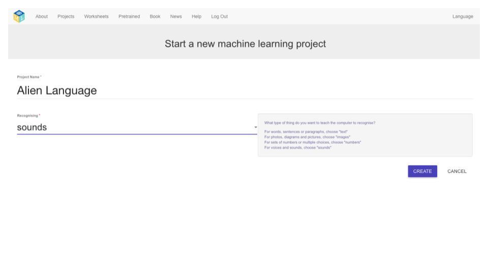

## 創建一個新專案
在接下來的幾個步驟中，你將訓練機器學習模型以了解它是如何完成的。 For the next part of the project, you will use your voice to control an alien character that does not understand English! You will invent two new words that would not be found in an English dictionary. Then, you will use the words to control the alien character, and train a machine learning model to recognise them.

First, go to the Machine Learning for Kids website and create a project.

--- task ---
+ Go to [machinelearningforkids.co.uk](https://machinelearningforkids.co.uk/){:target="_blank"}.

+ Click on **Get started**.

+ Click on **Try it now**. --- /task ---

--- task ---
+ Click on **Projects** in the menu bar at the top of the page.

+ Click the **Add a new project** button.

+ Name your project `Alien Language` and set it to learn how to recognise `sounds`. Then, click the **Create** button. 

+ You should see `Alien Language` in the projects list. Click on the `Alien Language` project. --- /task ---
